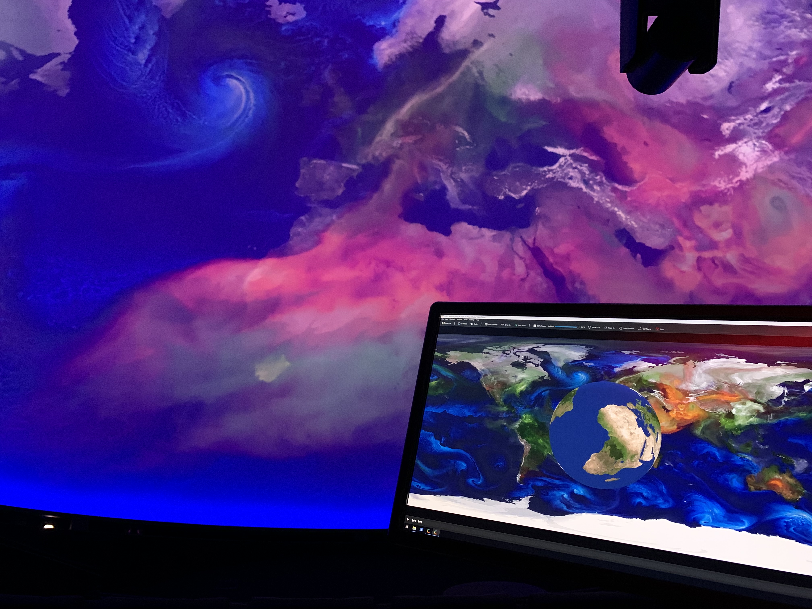

# C-Play : Cluster Media Player

C-Play is an open source cluster video player, based on these projects:

- [SGCT](https://github.com/sgct) - Simple graphics cluster toolkit, using GLFW/OpenGL etc
- [LibMPV](https://github.com/mpv-player/mpv) - command line video player, using FFmpeg
- [FFmpeg](https://github.com/FFmpeg/FFmpeg) - The one and only video decoder/encoder
- [Haruna](https://github.com/g-fb/haruna) - Qt/QML UI for MPV

Optional libraries in C-Play version 2.1 and above.

- [NDI SDK](https://ndi.video/for-developers/ndi-sdk/) - Support frame-synced NDI streams, video and audio
- [Poppler](https://poppler.freedesktop.org/) - For rendering PDF pages

# Documentation

https://c-toolbox.github.io/C-Play/

# Features

These are just some features that set C-Play apart from others players

- Runs on master/node setup and use QT/QML UI for master, and GLFW/SGCT client for nodes

- Playing audio only on master (support for audio settings, primarily using JACK for multi-channel output to ASIO devices)

- Sync playback, loading and other properties between master and nodes

- Support for GPU and CPU decoding and more through configuration files.

- Slides and layers, using numerous inputs, such as image, video, audio, NDI and PDF.

- Editing and saving playlist and playfiles including all necassary parameters.

- "Sections" and associated editor to create bookmarks to jump between clips inside a larger movie.

- Sync video+audio fade in/out

- HTTP Server API

- Tested and used on primarily Windows 10, in domes and other big arenas

# Build on Windows

- Use [Craft Guide](./docs/guides/build/dependencies/CRAFT_INSTALLS.md) to install all dependencies for the UI, from Qt and KDE Frameworks libs.

- Use the [Build FFMPEG and MPV Guide](./docs/guides/build/dependencies/BUILD_MPV_AND_FFMPEG.md) guide to build FFmpeg and MPV with JACK+portaudio support.

- Install optional libraries through such as NDI and Poppler (for PDF support), either through installers or using vcpkg.

- Configure C-Play with CMake.

- Good practice to follow [Deploy Guide](./docs/guides/build/dependencies/DEPLOY.md) as well, to copy the build with it's dependencies to single binary folder.

- Build in Visual Studio 2022 (or what viewer you prefer).
