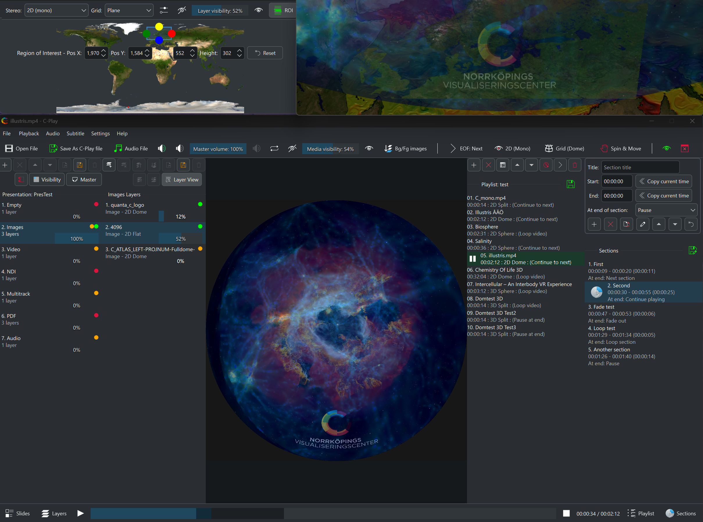

# C-Play : Cluster Media Player

C-Play is an open source cluster media player, useful for video playback and presentations in immersive environments (such as domes, powerwalls etc).

# Documentation

https://c-toolbox.github.io/C-Play/

# Content features
These are just some features that set C-Play apart from others media/video players:

C-Play support media that is:

- Stereoscopic (Side-by-side or Top-Bottom) and Monoscopic

- 180 fulldome / fisheye

- 360 equirectangular or equiangular cubemap (common on YouTube)

- Any "flat" media arbitary aspect ratio

Primary media (video and images) is easily opened and configured(through playfiles) and added to playlist for a standard media player setup.
An additional powerful feature in C-Play is the presentation tool, where you can be add arbitrary amount of layers within slides, using numerous inputs, such as 

- *Images* (JPG and PNGs)

- *PDF* (Common export format from PPT)

- *Videos* (H264, HEVC/H265, AV1/H266, VP9 etc) 

- *Audio* (WAV, AAC etc)

- *NDI* (Live streams form local network)

- *Streams* (Youtube etc supported through FFmpeg)

- *Text* (With custom font, also used for subtitles.) 

 With above layers, you can  make it as easy as using powerpoint to create an immersive presentation.

# Technical features

- Runs a QT/QML UI application on master computer and small none-UI GLFW/SGCT application on nodes/clients.

- Sync playback, loading and other properties between master and clients.

- Playing audio is usually performed on master *(Support for node audio is added in 2.2)*. Change of audio output is supported, and C-Play is pre-built with "JACK", which opens for multi-channel low-latency output to for instance ASIO devices.

- Loading external audio files as multiple tracks.

- Editing and saving playlist and playfiles including all necassary parameters.

- Configure "sections" in a editor to create bookmarks to jump between clips inside a larger movie.

- C-Play nodes can run on-top other application. For master, viewing your video (or layer) on secondary monitor is also simple and requires no extra decoding resources.

- HTTP Web API (Such that you can include control in custom system.)

- Tested and used on Windows 10/11, in domes and other big arenas.

## Backend
C-Play is an open source cluster video player, based on these open source projects:

- [SGCT](https://sgct.github.io/) - Our own simple graphics cluster toolkit
- [LibMPV](https://github.com/mpv-player/mpv) - command line video player, using FFmpeg
- [FFmpeg](https://github.com/FFmpeg/FFmpeg) - The one and only video decoder/encoder
- [Haruna](https://github.com/g-fb/haruna) - Qt/QML UI for MPV

Optional libraries in C-Play version 2.1 and above.

- [NDI SDK](https://ndi.video/for-developers/ndi-sdk/) - Support frame-synced NDI streams, video and audio
- [Poppler](https://poppler.freedesktop.org/) - For rendering PDF pages

# Build on Windows

- Use [Craft Guide](./docs/guides/build/dependencies/CRAFT_INSTALLS.md) to install all dependencies for the UI, from Qt and KDE Frameworks libs.

- Use the [Build FFMPEG and MPV Guide](./docs/guides/build/dependencies/BUILD_MPV_AND_FFMPEG.md) guide to build FFmpeg and MPV with JACK+portaudio support.

- Install optional libraries through such as NDI and Poppler (for PDF support), either through installers or using vcpkg.

- Configure C-Play with CMake.

- Good practice to follow [Deploy Guide](./docs/guides/build/dependencies/DEPLOY.md) as well, to copy the build with it's dependencies to single binary folder.

- Build in Visual Studio 2022 (or what viewer you prefer).
