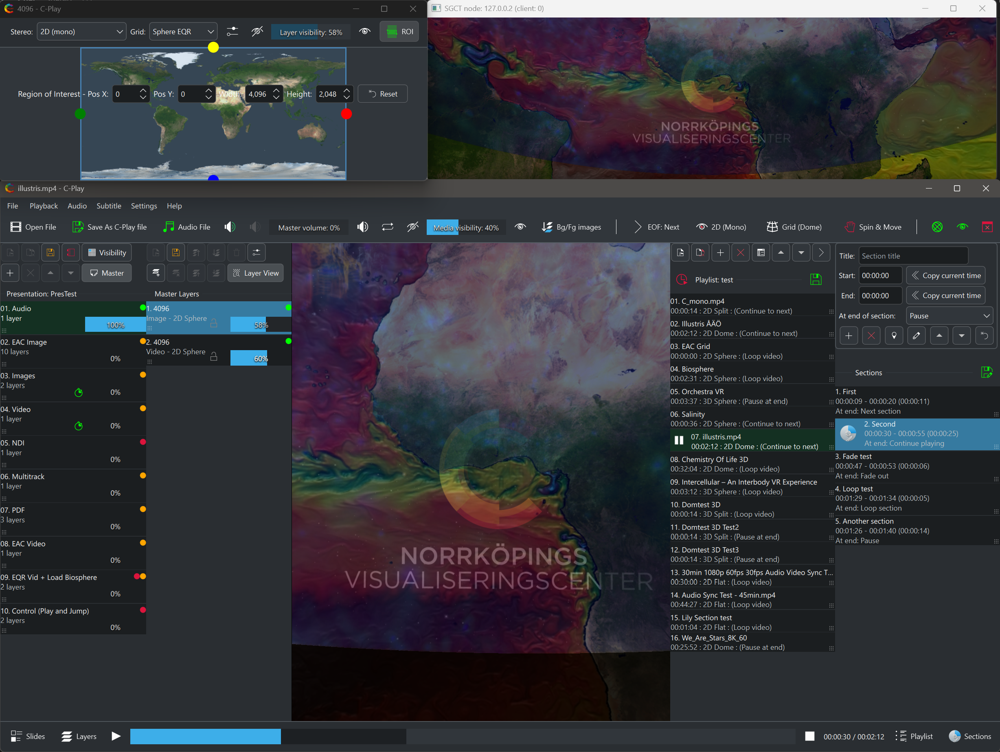

# C-Play : Cluster Media Player

C-Play is an open source cluster media player, useful for video playback and presentations in immersive environments, such as domes and powerwalls.

# Documentation

https://c-toolbox.github.io/C-Play/

# Content features
These are just some features that set C-Play apart from other media and video players:

C-Play support media that is:

- Stereoscopic (Side-by-side or Top-Bottom) and Monoscopic

- 180 fulldome / fisheye

- 360 equirectangular or equiangular cubemap (common on YouTube)

- Any "flat" media with arbitrary aspect ratio

Primary media, such as video and images, is easily opened and configured through playfiles and added to playlists for a standard media player setup.
An additional powerful feature in C-Play is the presentation tool, where you can add an arbitrary number of layers within slides using numerous inputs, such as:

- *Images* (PNG, JPG, TIFF, WEBP etc)

- *PDF* (Common export format from PPT)

- *Videos* (H264, HEVC/H265, AV1/H266, VP9 etc) 

- *Audio* (WAV, AAC, MP3 etc)

- *NDI*, *OMT* or *Spout* (Network video/audio or live sharing across local apps.)

- *Streams* (YouTube and similar inputs supported through FFmpeg)

- *Text* (With custom fonts, also used for subtitles)

With the layer types above, you can make it almost as easy as using PowerPoint to create an immersive presentation.

# Technical features

- Runs a Qt/QML UI application on the master computer and a small non-UI GLFW/SGCT application on the nodes/clients.

- Sync playback, loading and other properties between master and clients.

- Playing audio is usually performed on master *(Support for node audio is added in 2.2)*. Change of audio output is supported, and C-Play is pre-built with "JACK", which opens for multi-channel low-latency output to for instance ASIO devices.

- Loading external audio files as multiple tracks.

- Editing and saving playlists and playfiles including all necessary parameters.

- Configure "sections" in an editor to create bookmarks for jumping between clips inside a larger movie.

- C-Play nodes can run on top of other applications. On the master, viewing your video or a layer on a secondary monitor is also simple and requires no extra decoding resources.

- HTTP Web API, so you can integrate control into a custom system.

- Tested and used on Windows 10/11, in domes and other big arenas.

## Backend
C-Play is an open source cluster video player, based on these open source projects:

- [SGCT](https://sgct.github.io/) - Our own simple graphics cluster toolkit
- [LibMPV](https://github.com/mpv-player/mpv) - command line video player, using FFmpeg
- [FFmpeg](https://github.com/FFmpeg/FFmpeg) - The one and only video decoder/encoder
- [Haruna](https://github.com/g-fb/haruna) - Qt/QML UI for MPV

Optional libraries in current C-Play builds include:

- [NDI](https://ndi.video/for-developers/ndi-sdk/) - Support frame-synced NDI streams, video and audio
- [OMT](https://openmediatransport.org/) (Open Media Transport) - Support OMT video and audio streams
- [Poppler](https://poppler.freedesktop.org/) - For rendering PDF pages
- [SAIL](https://sail.software/) - For more extensive image decoding
# Build on Windows

- Use the [Craft Guide](./docs/guides/build/dependencies/CRAFT_INSTALLS.md) to install all dependencies for the UI, including Qt and KDE Frameworks libraries.

- Use the [Build FFMPEG and MPV Guide](./docs/guides/build/dependencies/BUILD_MPV_AND_FFMPEG.md) guide to build FFmpeg and MPV with JACK+portaudio support.

- Install optional libraries such as NDI, OMT, and Poppler, for network video/audio and PDF support, either through installers or using vcpkg where available.

- Configure C-Play with CMake.

- It is also good practice to follow the [Deploy Guide](./docs/guides/build/dependencies/DEPLOY.md) to copy the build and its dependencies into a single binary folder.

- Build in Visual Studio 2022, or whichever IDE you prefer.
