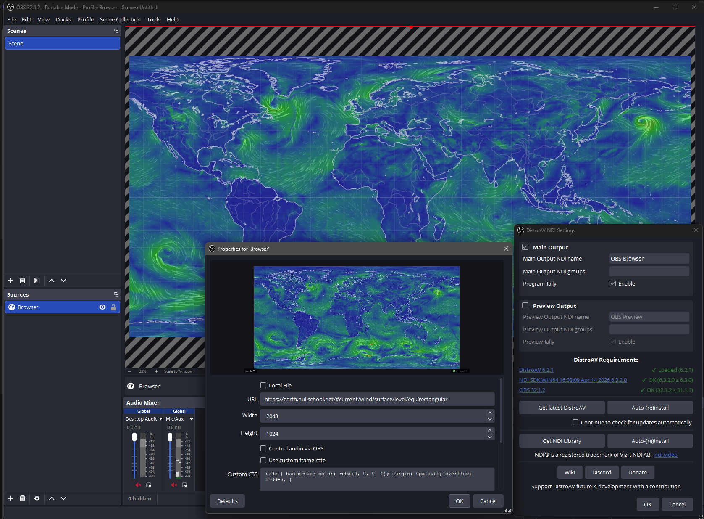
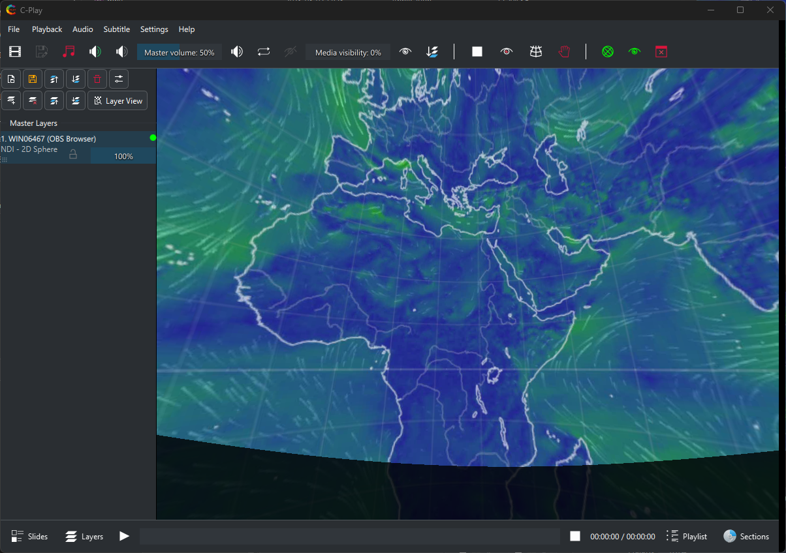

# OBS Studio + NDI -> C-Play

This page covers four topics:

1. [OBS Studio + NDI](#obs-studio-ndi) - send an OBS program feed into C-Play
2. [Browser example](#obs-browser-example) - capture a browser page in OBS and receive it as NDI
3. [VDO.Ninja example](#obs-vdoninja-example) - bring a remote guest into C-Play through OBS
4. [Multiple OBS outputs](#multiple-obs-outputs) - run more than one independent NDI sender

---

## OBS Studio + NDI<a name="obs-studio-ndi"></a>

OBS Studio is useful as a live-input bridge for C-Play. OBS can capture browsers, webcams, capture cards, remote guests, screen regions, and composited scenes, then publish the final result as an NDI source. C-Play receives that NDI source as a normal presentation layer.

The basic signal flow is:

```text
Browser / VDO.Ninja / camera / capture card -> OBS Studio -> NDI output -> C-Play NDI layer
```

### Install and enable NDI in OBS

1. Install OBS Studio 28 or newer.
2. Install an OBS NDI plugin that matches your OBS version.
3. Install the NDI runtime if the plugin requires it.
4. Restart OBS after installing the plugin.
5. In OBS, enable the NDI output you want to use. Depending on the plugin version this is usually under **Tools -> NDI Output Settings**.
6. Give the NDI output a clear name, for example `OBS Browser` or `OBS VDO Ninja`.

Use the main/program NDI output when you want C-Play to receive whatever OBS is currently showing in Program. Use a source-specific NDI output only when you need a particular OBS source to be available independently.

### Receive the OBS NDI output in C-Play

1. In C-Play, open the presentation/layers workflow.
2. Add a new layer and choose **NDI**.
3. Pick the OBS NDI sender from the discovered source list.
4. Configure the layer grid, stereo mode, alpha, and plane settings as needed.
5. Trigger the slide and verify that the OBS output appears in C-Play.

If the NDI source does not appear, check that OBS and C-Play are on the same network, that the NDI runtime/plugin is loaded, and that Windows Firewall is not blocking OBS or C-Play.

The OBS scene can then be controlled from C-Play through REST/WebSocket commands. See [Launch apps and control things with C-Play](rest-troll-obs) for the OBS WebSocket setup.

---

## OBS Browser Example<a name="obs-browser-example"></a>

This setup is good for dashboards, web visualizations, timers, local HTML tools, or any web page that is easier to render in OBS than directly in C-Play.

1. In OBS, create a scene named `Browser`.
2. Add a **Browser** source.
3. Set the URL to the page you want to show.
4. Set the browser source width and height to the intended output size, for example `1920 x 1080`.
5. If the page has audio, enable the audio settings needed by your OBS/NDI plugin.
6. Enable OBS NDI output and name it `OBS Browser`.
7. In C-Play, add an **NDI** layer and select the `OBS Browser` sender.





For web pages that animate or react to user input, keep OBS open on the same machine that renders the page. C-Play receives the final video frames through NDI, so the browser source can use whatever browser features OBS supports.

You can switch OBS to this scene from C-Play with a WebSocket command:

| Field | Value |
|-------|-------|
| URL | `ws://localhost:4455` |
| Method | `WS` |
| OBS request | `SetCurrentProgramScene` |
| Request data | `sceneName = Browser` |

---

## OBS VDO.Ninja Example<a name="obs-vdoninja-example"></a>

[VDO.Ninja](https://vdo.ninja/) can bring a remote camera or screen-share feed into OBS with low latency. OBS can then publish that feed as NDI so C-Play can use it as a live layer.

One practical setup is:

1. Create or join a VDO.Ninja room.
2. Copy the guest, director, or view link you want OBS to render.
3. In OBS, create a scene named `VDO Ninja`.
4. Add a **Browser** source and paste the VDO.Ninja view URL.
5. Set the source resolution to match the intended production format.
6. In OBS audio settings, route the VDO.Ninja audio if it should be included in the NDI feed.
7. Enable OBS NDI output and name it `OBS VDO Ninja`.
8. In C-Play, add an **NDI** layer and select `OBS VDO Ninja`.

If you want OBS to output only the VDO.Ninja scene, keep that scene in Program. If you want OBS to composite VDO.Ninja with lower thirds, masks, captions, or other graphics, build that composite in OBS and send the program output to C-Play.

You can also let C-Play switch OBS into the VDO.Ninja scene when a slide starts. Create a REST/WebSocket command with:

| Field | Value |
|-------|-------|
| URL | `ws://localhost:4455` |
| Method | `WS` |
| OBS request | `SetCurrentProgramScene` |
| Request data | `sceneName = VDO Ninja` |

### Audio notes

NDI can carry audio, but the exact path depends on the OBS NDI plugin and how OBS is monitoring/mixing the browser source. Test audio before show time, especially if C-Play is also playing local media audio.

For remote guests, use headphones or echo cancellation on the VDO.Ninja side. OBS should generally receive a clean guest feed and send that onward to C-Play.

---

## Multiple OBS outputs<a name="multiple-obs-outputs"></a>

For multiple independent NDI feeds, the simplest setup is usually multiple OBS portable directories. Each directory has its own OBS settings, scene collections, NDI output name, and WebSocket port.

Example:

| OBS directory | Scene collection | NDI output | WebSocket URL |
|---------------|------------------|------------|---------------|
| `D:\OBS-Browser` | `C-Play Browser` | `OBS Browser` | `ws://localhost:4455` |
| `D:\OBS-VDO-Ninja` | `C-Play VDO Ninja` | `OBS VDO Ninja` | `ws://localhost:4456` |

Launch each instance with `--portable`, `--multi`, and a unique `--websocket_port`. The matching C-Play REST/WebSocket commands should target the matching port.


