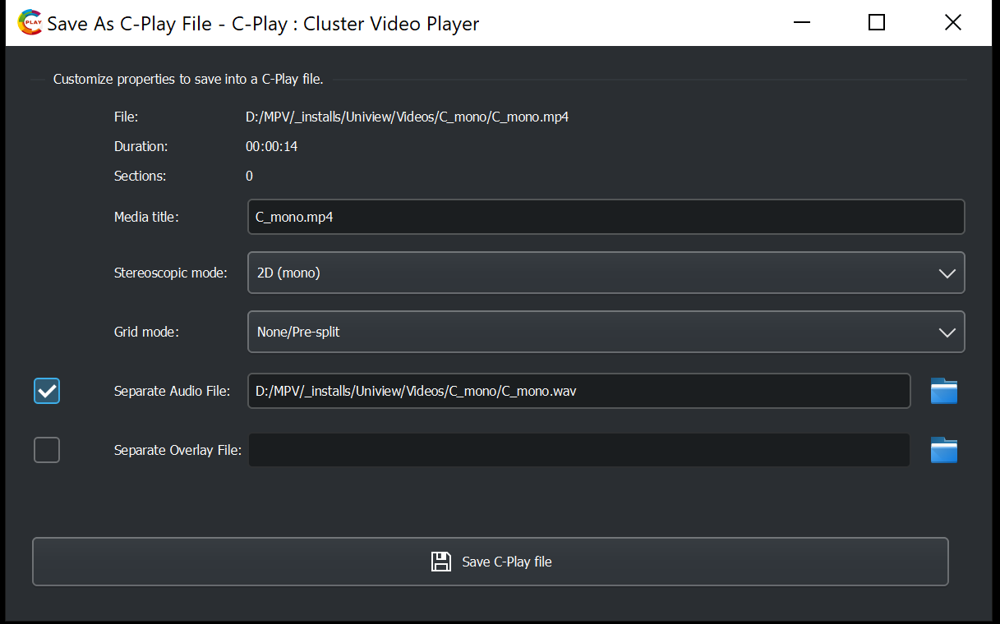

# Build video description files (*.cplayfile)

 C-Play can open any format that MPV support, which is basically any that the included FFmpeg libraries support.

 However, there is good practice to build a ".cplayfile" of any your video files, to store all of the descriptive settings, which C-Play get from MPV or which can be user-defined.
 
 These user defined settings are:

 * Media title
 * Stereoscopic mode
     * 2D (mono)
     * 3D (side-by-side)
     * 3D (top-bottom)
     * 3D (top-bottom+flip)
* Grid mode
     * 2D (mono)
     * 3D (side-by-side)
     * 3D (top-bottom)
     * 3D (top-bottom+flip)
* Separate Audio File
     * C-Play supports incorporated audio tracks in the video, however, through this option a seperate file can be loaded (on the master) as the default selected audio track.
* Separate Overlay File
     * C-Play support the loading of an overlay image file (such as *.png or *.jpg) to be overlayed ontop of the video. This might be useful when mapping a static world map ontop a video showing ocean flow, for instance. This overlay file needs to be loaded when the video is, thus can only be define in a *"*.cplayfile*".

## Sections

Sections is a concept similar but more powerful then bookmarks or chapters in a video. Every section has a title, start time, end time and eos(*end of section*) mode.

Basically, a section is a piece of the video that can be triggered easily, with various *end behaviours* depending on eos mode. The different eos modes are:

* Pause
* Fade out video, then pause
* Continue video (do not pause)
* Next section
* Loop section

The sections view, where sections are created and managed, is opened in the bottom right (or bottom left, depending on settings). 

It should be straight-forward to build sections, and while you can edit start and stop time manually, you can easily grab then from the current time in the video.

## Workflow for *.cplayfile creation

1. Just load the video (mp4 etc) in C-Play. 

If the setting *"Load audio files in same folder as video file"* in the audio configuration settings is checked, any adjacent audio file will be loaded as an audio track as well.

1. In the header menu, select correct *"Audio File"*, *"Stereo (2D or 3D) mode"* and *"Grid Mode"*, such that your video is combined with desired audio track and looks correct in your environment (arena, dome etc).

1. Optionally, define "*Sections*" for you movie/video if you want to have users jump to certain pre-defined locations.

1. Click the button *"Save As C-Play File"* in the header menu, which will open the dialog below.
 
 The dialog will already be pre-defined with the current user defined values currently chosen in C-Play. You can change any value here before you save as well, and optionally add an overlay image as well.

 1. Click "*Save C-Play File*" do save it, preferably in the folder you defiend in the "*General settings*" as "*Common C-play file location*", which if set, is the start location when this dialog opens.