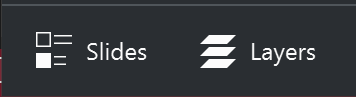
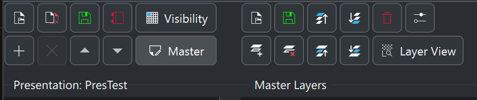
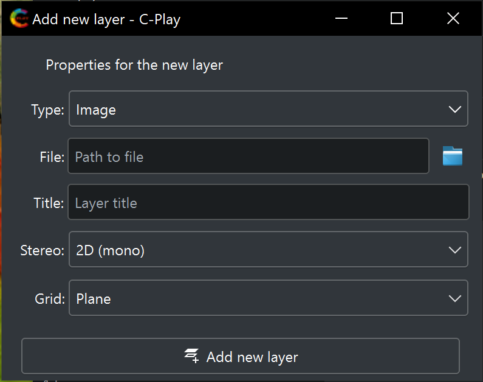
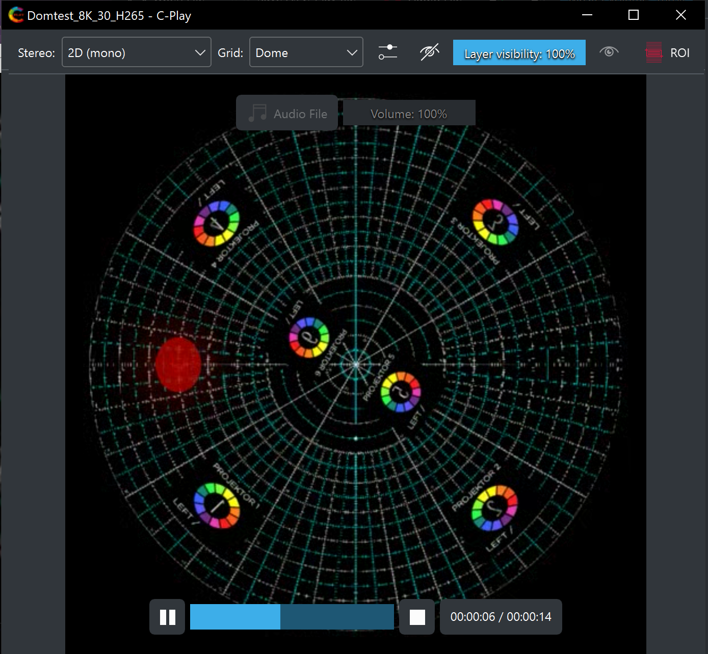
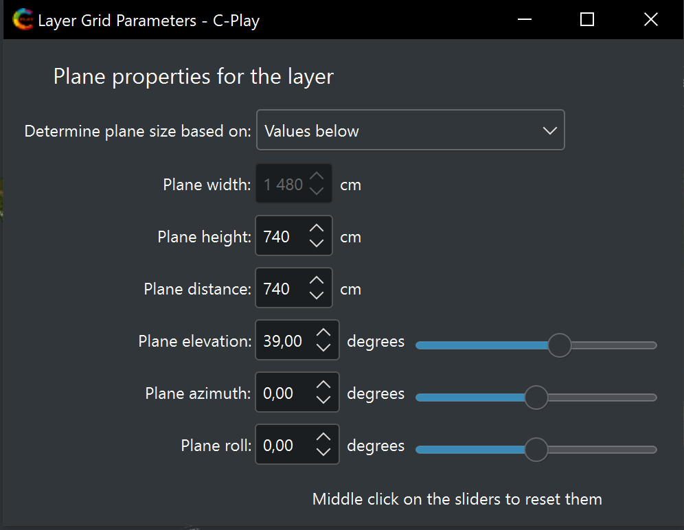
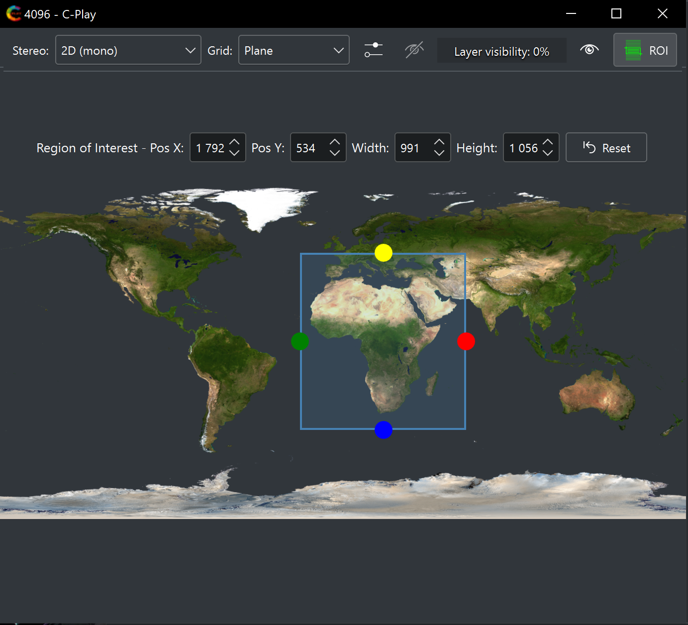
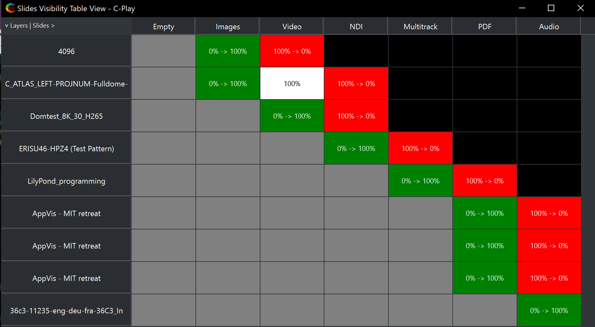
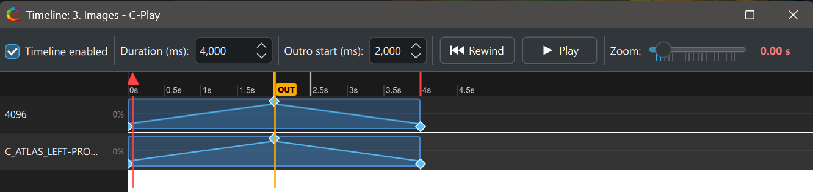

# Build and save a presentation (*.cplaypres)

Presentations in C-Play are essentially a list of *slides*, where each slide contains a list of *layers*. These lists can be saved and loaded as "*.cplaypres" files.

These lists are shown or hidden through the buttons on either the left or right side of the *footer* taskbar, depending on your playlist preference.

{:width="30%"}

When showing the slides and layers lists, the top of these lists includes the primary controls for building slides with layers.

{:width="85%"}

#### Slides toolbar

The slides panel toolbar (first and second row):

| Icon | Action |
|------|--------|
|  | Open a saved presentation |
|  | New presentation (clear all slides) |
|  /  | Save presentation (lime = saved, orange = unsaved changes) |
|  /  | Pre-load layers toggle (lime = on, crimson = off) |
|  | Slide visibility table view |
|  | Add slide to bottom of list |
|  | Remove selected slide |
|  | Move selected slide up |
|  | Move selected slide down |
|  | Master slide (permanent background layers) |

#### Layers toolbar

The layers panel toolbar (first and second row):

| Icon | Action |
|------|--------|
|  | Open presentation |
|  /  | Save presentation |
|  | Move selected layer to top |
|  | Move selected layer to bottom |
|  | Clear all layers |
|  | Configure grid parameters |
|  | Add a new layer |
|  | Remove selected layer |
|  | Move selected layer up |
|  | Move selected layer down |
|  | Layer view (inspect selected layer) |

Even if you have not created any slides, there is always a special slide called *Master* that you can add layers to. The special thing about the *master* slide is that layers in this slide are always rendered in front of the background image, but behind any media you play from *"Open file"* or through the playlist. Hence, the master layers essentially work as flexible background layers. Layers in the other slides are rendered in front of the media in the main player, and the foreground image is on top.

I.e., from top to bottom in render hierarchy:

*  Foreground image
*  Slides in list
*  Main media
*  Master slide
*  Background image

To add new layers, click the  "+" button to the left in the layers list, and the *"Add new layer"* will become visible. 

{:width="50%"}

Here you can choose from the following layer types:

| Layer type | Best used for |
|------------|---------------|
| **Image** | Supported extensions: *.png*, *.jpg*, *.jpeg*, *.tga*., *.tiff*., *.webp*. |
| **Video** | Common supported extensions: *.mp4*, *.mkv*, *.mov*, *.webm*, *.mpeg*. |
| **Audio** | Common supported extensions: *.wav*, *.mp3*, *.flac*, *.ogg*, *.m4a*. |
| **PDF** | Document pages, slides, or signage content imported from a PDF file. |
| **NDI** | Live video and audio received from an NDI sender on the network. |
| **OMT** | Live video and audio received from an OMT sender on the network. |
| **Spout** | Live video shared from another Windows application on the same machine. |
| **Stream** | Capture cards, camera feeds, URLs, or other MPV-compatible live inputs. |
| **Control** | Non-visual automation commands for playback, fades, loading, and timing control. |
| **REST** | Non-visual HTTP or WebSocket request fired when the slide is triggered (e.g. control lighting, projectors, OBS Studio, or other applications). |

The file-based layer types *Image*, *Video*, *Audio*, and *PDF* are chosen through file dialogs. The default dialog locations of each of these types can be changed in "Settings -> Configure -> Location", as seen [here](../settings/location).

When choosing *"NDI (Network Device Interface)"*, a combobox becomes visible instead of the file dialog field. The combobox contains the discovered NDI sources on the network that can be received. Both image and audio are supported through NDI.

When choosing *"OMT (Open Media Transport)"*, a combobox becomes visible instead of the file dialog field. The combobox contains the discovered OMT sources on the network that can be received.

When choosing *"Spout"*, a combobox becomes visible instead of the file dialog field. The combobox lists the currently available Spout senders from other Windows applications on the same machine, and the refresh button can be used to rescan the sender list. This makes it practical to bring live rendered content such as graphics, real-time engines, or capture tools directly into a slide as a video layer. Spout layers are available by default in C-Play v2.3 Windows builds.

When choosing *"Stream"*, you can choose between pre-defined streams for your system in a combobox, loaded from the editable file *"data/predefined-streams.json"*, or add a custom entry in a text field. The stream is handled as video/audio with the MPV library, so explore the possibilities further through the MPV documentation.

When choosing *"Control"*, the layer does not display any visual content. Instead, it dispatches a player control operation when activated through the slide timeline. Control layers exist only on the master node and are useful for automating playback actions within a presentation.

In the layer view for a control layer, two fields are shown instead of the usual grid/stereo parameters:

* **Operation** — The command to execute. Available operations include:
  * **Playback**: Play, Pause, Stop, Rewind, Seek, SetPosition, SetSpeed
  * **Volume & Fading**: SetVolume, FadeVolumeDown, FadeVolumeUp, FadeImageDown, FadeImageUp, SetSyncVolumeVisibilityFading
  * **Loading**: LoadFromPlaylist, LoadFromSlides, LoadFromSections, LoadFromAudioTracks
  * **Orientation**: SpinPitchUp, SpinPitchDown, SpinYawLeft, SpinYawRight, SpinRollCW, SpinRollCCW, OrientationAndSpinReset, RunSurfaceTransition
  * **Surface & Visibility**: SetBackgroundVisibility, SetForegroundVisibility, SetNodeWindowsOpacity

* **Parameter** — An operation-specific value. For example, a volume level for SetVolume, a millisecond position for Seek, a slide name or index for LoadFromSlides, or `true`/`false` for boolean operations. Parameters that reference playlist items, slides, or audio tracks can be specified by name or numeric index.

When choosing *"REST"*, the layer sends an HTTP or WebSocket request when its slide is triggered. Like Control layers, REST layers are non-visual and exist only on the master node. They are useful for integrating external systems — such as lighting controllers, projectors, OBS Studio, or other networked applications — into your presentation workflow.

In the layer view for a REST layer, three fields are shown:

* **URL** — The target HTTP or WebSocket endpoint. You can either select a predefined command from the dropdown (populated by the REST Commands Editor) or toggle to custom mode and enter a URL manually.
* **Method** — The request method: `GET`, `POST`, `PUT`, `DELETE`, `WS`, or `WSS` (visible in custom mode).
* **Parameters** — A list of name/value pairs, each with individual UI fields that can be added or removed as needed (visible in custom mode). This format supports values with spaces and special characters. For POST/PUT these are sent as the request body; for GET/DELETE they are appended as query parameters; for WS/WSS they are sent as a WebSocket message or OBS WebSocket request data.

When the slide is loaded, the REST layer fires the configured request on a background thread and reports success or failure.

For more details on the REST layer and the REST Commands Editor, see the [HTTP Web API documentation](../remote/api#rest-layer).

After you have added a new layer, you can specify its parameters in more detail through the *"Layer View"*. Here you control grid and stereo parameters, the volume level if applicable, and inspect how the output looks.

{:width="40%"} &nbsp;&nbsp;&nbsp; {:width="48%"}

###  Region of Interest

In the top right, there is a *"Region of interest (ROI)"*  /  button that enables the feature below, where you can specify a certain region of your layer that should be visible. This is useful when you want to show only part of the source.

{:width="80%"}

###  Layer visibility across slides.

In the slides menu there is a button named *"Visibility"* , which opens the window named *"Slide Visibility Table View"* when clicked. The window lets you control and review how layers behave across slides. This means that you can create layers that are visible across multiple slides, instead of only being shown during one specific slide. The meanings of the different cell colors are:

* A grey cell means layer not yet available.

* A red cell (100 -> 0%) means the layer fades out.

* A green cell labeled (0 -> 100%) means this layer fades in when the slide is triggered. Click this cell to make the next cell red.

* A white cell (100%) means the layer stays visible. Click this cell to make the next cell red.

* A black cell can be changed to a white cell by clicking it.

Remember, master layer visibility usually fades in and out depending on media visibility. See [presentation settings](../settings/presentation).

{:width="80%"}

###  Timeline (C-Play v2.3 and newer)

The timeline is a per-slide animation system that lets you animate layer properties over time using keyframes. Each slide can have its own timeline with a configurable duration (default 5 seconds).

{:width="80%"}

#### Animatable properties

For each keyframe you can set:

* **Alpha (Opacity)** — from 0.0 (transparent) to 1.0 (fully visible)
* **Rotation** — X, Y, Z angles in degrees
* **Translation** — X, Y, Z positional offset

The system interpolates smoothly between keyframes at 60 FPS during playback.

#### Using the timeline editor

Enable the timeline for a slide via the toolbar toggle. The editor displays one track per layer, with a time ruler across the top.

* **Add a keyframe** — Double-click on a layer track at the desired time.
* **Select and edit** — Click a keyframe to select it, then modify its properties (time, alpha, rotation, translation) in the inspector panel.
* **Delete a keyframe** — Right-click on an existing keyframe.
* **Scrub** — Drag the red playhead line to preview the animation at any point.
* **Zoom** — Use the zoom slider to adjust the time scale.

#### Intro and outro sections

The timeline can be split into an *intro* and *outro* section by dragging the amber divider line. This lets you define separate fade-in and fade-out animations within the same timeline. When the outro finishes, layers fade to zero opacity and the timeline stops.

#### Playback modes

| Mode | Description |
|------|-------------|
| **Forward** | Plays from the start to the outro point (or end). |
| **Reverse** | Plays backward from the end to the start. |
| **Intro only** | Plays only the intro section. |
| **Outro only** | Plays only the outro/fade-out section. |
| **From position** | Resumes playback from a custom scrub position. |

#### Saving

Timeline data, including all keyframes and duration settings, is stored in the *.cplaypres* file alongside the rest of the slide and layer definitions.

