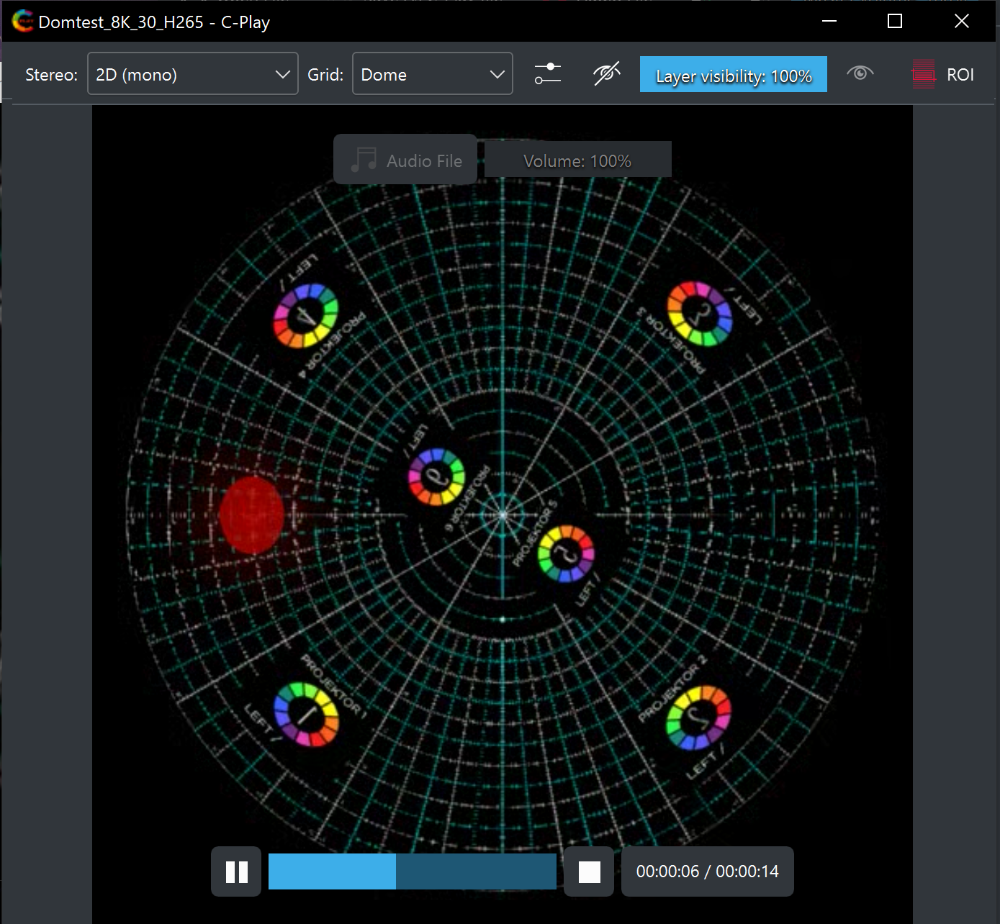

# Build and save a presentation (*.cplaypres)

Presentations in C-Play essentially a list of *slides* consisting, where each slide is a list of *layers*. These list can be saved/loaded as "*.cplaypres" files.

These list are shown/hidden through the buttons on either the left or right side in the *footer* taskbar (depending on your preference for the playlist).

{:width="30%"}

When showing the slides and layers lists, the top of these list including the primary controls for building slides with layers.

{:width="85%"}

Even if you haven't created any slides, there is always a special slide called *Master* accessible to add layers too. The special thing with the master slide is that layers in this slide are always rendered in front of the background images, but behind and media you play from *"Open file"* or through the playlist. Hence the master layers essentially work a flexible background layers.

To add new layers, click the "+" button to the left in the layers list, and the *"Add new layer"* will become visible. 

{:width="50%"}

Here you can choose to add layers of the following types:

* Image
* Video
* Audio
* PDF
* NDI
* Stream (capture cards etc)

The four first ones all are local or network files that are chosen through file dialogs. The default dialog locations of each of these types can be changed in "Settings -> Configure -> Location", as seen [here](../settings/location).

When choosing *"NDI (Network Device Interface)*" a combobox becomes visible instead of the file dialog field. The combobox contains all of the discovered NDI sources on the network which can be received. Both image and audio is supported through NDI.

When choosing *"Stream*" you can choose between pre-defined streams for your system in a combobox (loaded from editable file *"data/predefined-streams.json*") or to add a custom entry in a text field. The stream is handled as video/audio with the MPV library, so explore possibilities through the MPV docs.

After you've added a new layer, you can specify the parameters of the layer in more detail through the *"Layer View*". Here you control grid/stereo parameters, the volume level (if applicable), as well as check how the output looks like.

{:width="40%"} &nbsp;&nbsp;&nbsp; {:width="48%"}

### Region of Interest

In the top right, there is *"Region of interest (ROI)"* button, that enables a feature below where you can specify a certain region of you layer that should be visible. This is useful for when you want to show only a part of the source.

{:width="80%"}

### Layer visibility across slides.

In the slides menu there is a button named *"Visibility"*, which when clicked opens the window name *"Slide Visibility Table View"*. The window let's you control and overview how layer *live* across slides. This means that you can create layers that are visible across multiple slides, instead of only being shown during one specific slide. The meanings of the different cell colors are:

* A grey cell means layer not yet available.

* A red cell (100 -> 0%) means the layer fades out.

* A green cell titled (0 -> 100%) means this layer fades in when the slide is triggered. Click this cell to make the next cell red.

* A white cell (100%) means they layer stays visible. Click this cell to make the next cell red.

* A black cell can be altered to a white cell, if pressed.

Remember, master layers visibility is fade in/out usually depend on media visibility (See [presentation settings](../settings/presentation)).

{:width="80%"}

