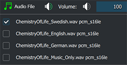
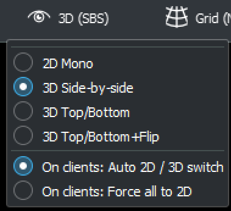
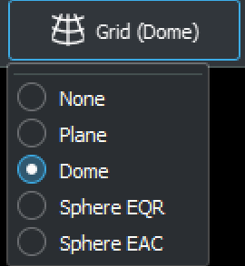
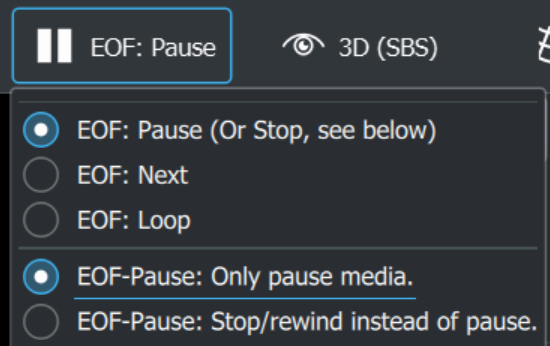
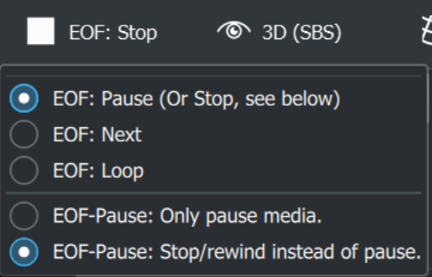

# Control/select media features

These are the runtime controls to use when a file has been loaded from either *"Open File"* or from the playlist.

Start with selection of an audio track. You can switch the audio track even when the video is loaded and playing *(though it is recommended to pause first, to preserve good sync between audio and image.)*

{:width="70%"}

*"Note: You can in the Audio Settings set to load all external audio tracks alongside the video file. Embedded tracks are always loaded"*

### Video/image mapping

If the video/image media is not correctly mapped (looks weird), most likely the correct media mapping have not been set for this particular media.

First make sure to select what type of *stereoscopic mode* your content has, and then also specify if what type of *grid* your content should be mapped on.

These are the grid mappings for specific content:
1. *None* : For pre-splitted movies (meaning content is prepared in advanced to look correct on every client). Every client normally has different video content (but still same file names).
1. *Plane* : For regular flat media, to map it onto a plane in 3D space.
1. *Dome* : For fulldome/fisheye video/image content (1:1 aspect ratio).
1. *Sphere EQR* : 360 equi-rectangular content (2:1 aspect ratio).
1. *Sphere EAC* : 360 equi-angular cubemap (preferred by Google/YouTube).

{:width="30%"} &nbsp;&nbsp;&nbsp;&nbsp;&nbsp;&nbsp;&nbsp;&nbsp;&nbsp;&nbsp;&nbsp;&nbsp; {:width="21.5%"}

*Note: You can force 3D content to be displayed as 2D by forcing 2D, with the settting below in the stereoscopic mode drop-down menu.*

### Control what happens at "End of file" 

When your video/audio has finished playing, you can set what happens at the "end of file".
The different modes are:

1. *EOF - Pause* : Just pause when the media has reached it's end.
1. *EOF - Next* : Go to next file in the playlist automatically.
1. *EOF - Loop* : Loop the media file (infinite).

{:width="40%"} &nbsp;&nbsp;&nbsp; {:width="40%"}

*Note: As seen above, you can choose to replace all triggers of a "Pause" in the end of a file to perform a "Stop" instead. Does, your video will stop/rewind to start instead of pausing in the end. In the settings, you can also trigger a "media visibility fade down" when a stop/rewind occurs.*