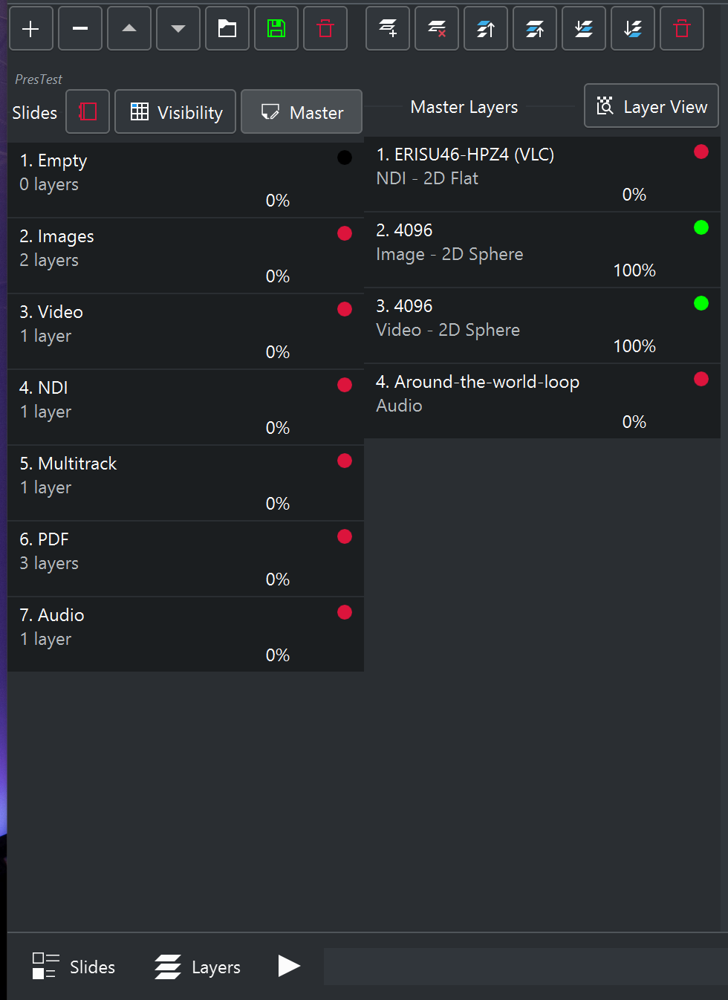
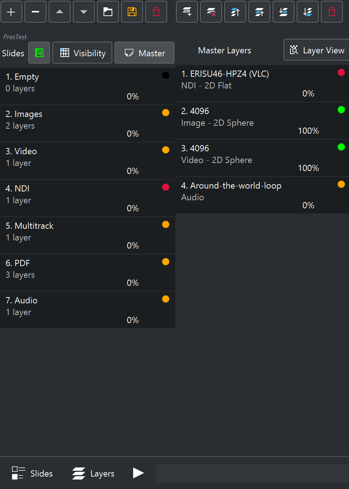
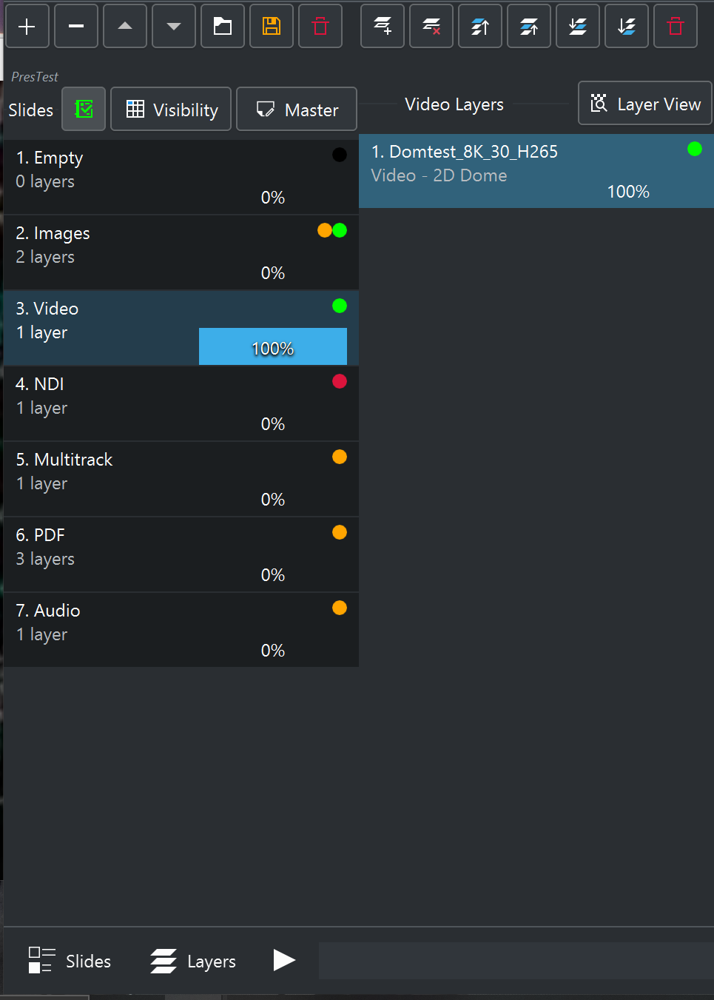
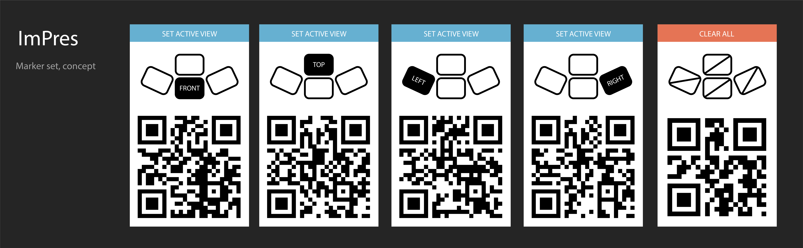

# Presentation (Slides & Layers)

A presentation can be built according to the guide seen [here](../media/cplaypres).

For playing a presentation, you can use the left/right arrow of the keyboard (if you haven't changed the default keyboard shortcuts), to move forwards and backwards in the slide deck. At startup, when a presentation is loaded, no slides other then master layers should ideally be visible (good practice before saving the presentation), as seen in the left image below. Notice that the *"pre-load icon"*  to the right of *"Slides:"*, always is red at startup. This is so pre-loading does not occur if the presentation is not suppose to be used, even if loaded at startup.

As seen in the middle image, when pressing the *"Pre-Load"* button , it turns green and all slides shift from *Red* to *Orange*, which means that the slides, and i.e. the layers are loaded, but not yet visible. When a slide is triggered and the layers become visible, they turn *Green*. If a slide contains both visible and non-visible layers, two colors might show in the slide, as indicated in the image below to the right.

{:width="29%"} &nbsp;&nbsp;&nbsp; {:width="29%"} &nbsp;&nbsp;&nbsp; {:width="29%"}

In the *"Visibility"*  window, you can ask layers to be visible during multiple slides, which may come handy, if you want a background media to be visible during a set number of slides, to fade in layers one-by-one onto your screen.

{:width="80%"}

For changing the presentation timings, this is made in the "Settings -> Configure  -> Presentation", as seen [here](../settings/presentation).

## QR code presentation mode  (C-Play v2.3 and newer)

NDI and Stream layers support a QR code-driven presentation mode called **ImPres**. When enabled, C-Play scans incoming video frames for QR codes and uses them to control frozen video sublayers — useful for interactive multi-angle presentations where a camera feed carries embedded QR commands.

{:width="80%"}

### Enabling the mode

In the layer view for an NDI or Stream layer, check *"ImPres Mode (QR Code Detection)"*. This setting is saved with the presentation.

### Example
You can open an example powerpoint from `data/impres/ImPres_PPT_Template.ppt` that showcases how the QR codes could be displayed in proper way, which is being visible directly when new slide becomes visible and then disappears quiet fast.

### How it works

The system uses a two-phase processing scheme:

1. **Phase 1 (control frame)**: A QR code is detected in the video frame. The command is queued and the frame is skipped — the previous clean frame stays on screen so the QR code is never visible to the audience.
2. **Phase 2 (clean frame)**: No QR code is detected. All queued commands are executed and the frame is displayed normally.

This means the QR code only needs to appear for a single frame to be picked up.

### QR command format

Commands are encoded as text in the QR code using semicolons as delimiters:

```
<target>;<action>
```

**Targets** are plane names defined in the configuration file (see below), or `All` for bulk operations.

**Actions:**

| Action | Description |
|--------|-------------|
| `SetActive` | Switch to this plane — freeze all other sublayers and start displaying live video in the target plane. If the plane does not exist yet it is created. |
| `Clear` | Fade all sublayers to transparent (use with target `All`). |

Multiple actions can be chained: `FrontCapture;SetActive;Freeze`.

### Predefined planes

Planes define where frozen sublayers appear in the dome or sphere. They are configured in `data/impres/config.json`:

```json
{
  "planes": [
    { "name": "FrontCapture" },
    { "name": "LeftCapture", "azimuth": -45 },
    { "name": "RightCapture", "azimuth": 45 },
    { "name": "TopCapture", "elevation": 65 }
  ]
}
```

Each plane can optionally specify `height`, `azimuth`, `elevation`, `roll`, and `distance`. Properties that are not specified are inherited from the parent layer.