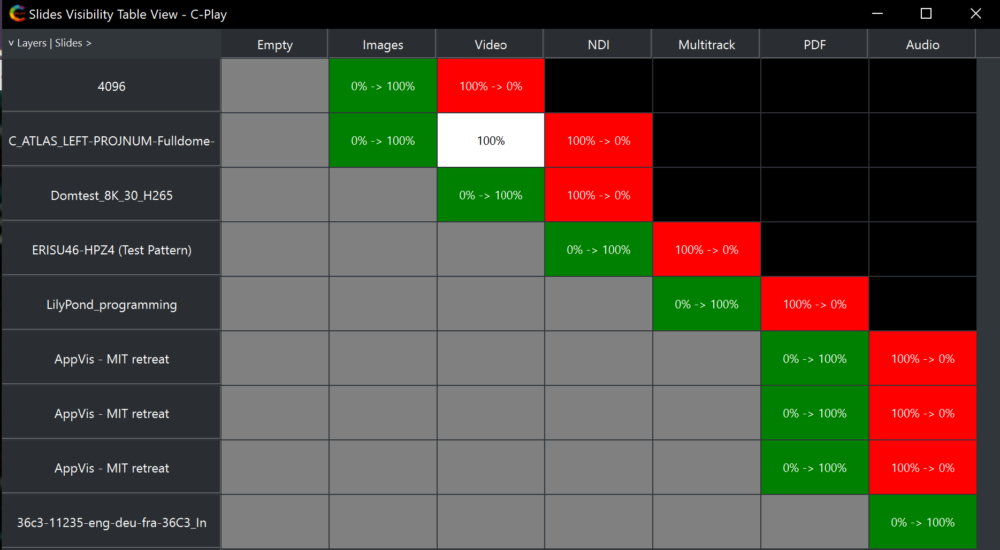

# Presentation (Slides & Layers)

A presentation can be built according to the guide seen [here](../media/cplaypres).

For playing a presentation, you can use the left/right arrow of the keyboard (if you haven't changed the default keyboard shortcuts), to move forwards and backwards in the slide deck. At startup, when a presentation is loaded, no slides other then master layers should ideally be visible (good practice before saving the presentation), as seen in the left image below. Notice that the *"pre-load icon"* to the right of *"Slides:"*, always is red at startup. This is so pre-loading does not occur if the presentation is not suppose to be used, even if loaded at startup.

As seen in the middle image, when pressing the *"Pre-Load"* button, it turns green and all slides shift from *Red* to *Orange*, which means that the slides, and i.e. the layers are loaded, but not yet visible. When a slide is triggered and the layers become visible, they turn *Green*. If a slide contains both visible and non-visible layers, two colors might show in the slide, as indicated in the image below to the right.

{:width="29%"} &nbsp;&nbsp;&nbsp; {:width="29%"} &nbsp;&nbsp;&nbsp; {:width="29%"}

In the *"Visibility"* window, you can ask layers to be visible during multiple slides, which may come handy, if you want a background media to be visible during a set number of slides, to fade in layers one-by-one onto your screen.

{:width="80%"}

For changing the presentation timings, this is made in the "Settings -> Configure -> Presentation", as seen [here](../settings/presentation).