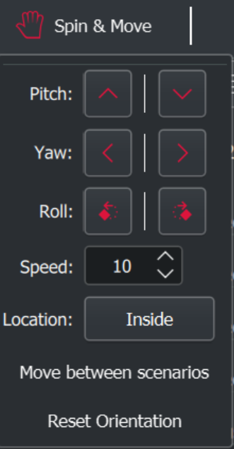
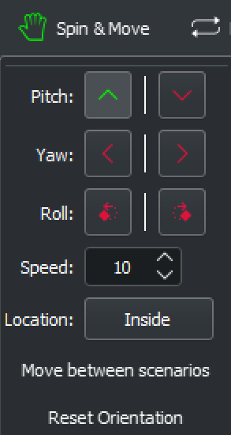

## Spin & Move / 360 Control

C-Play has built in some controls to make static material feel a bot more alive, or alter the viewpoint of certain material at runtime. These are located in the UI header under the *"Spin & Move"* button.

This section is only enabled if you have chosen to map your content on either a dome or a sphere.

When using a dome mapping, only the *Yaw* rotation controls are enabled (as seen to the left below), to facilitate a rotation of your media to put it on a different orientation.

When mapped on a sphere, alongside *Yaw*, *Pitch* and *Roll* is enabled as well (as seen in the middle image below).

You clearly see in the icon coloring, both in the header taskbar, and in the drop-down UI, that a *spin operation* is enabled.

{:width="28%"} &nbsp;&nbsp;&nbsp; {:width="28%"} &nbsp;&nbsp;&nbsp; {:width="28%"}

The four additional controls and triggers are:

1. *Speed*: The speed of all the above operations.

1. *Location*: Intuitive way the rotation corresponds to the control, either when your *inside* an object or *outside* an object (such as a sphere).

1. *Move between scenarios*: Moves between the current values and the *"Alternative Transition Scenario”*, as further described in the [Grid & Mapping settings](../settings/grid.md).

1. *Reset orientation*: Resets all operations above to the default values.

*Note: A change in the Grid mode of a grid type triggers an automatic reset.*