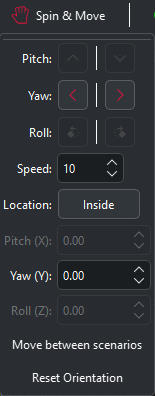
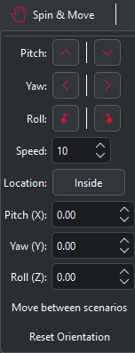
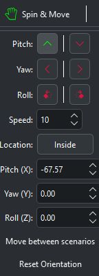

# {:height="24px"} Spin & Move / 360 Control

C-Play has built-in controls to make static material feel a bit more alive, or to alter the viewpoint of certain material at runtime. These are located in the UI header under the *"Spin & Move"*  /  button.

This section is only enabled if you have chosen to map your content on either a dome or a sphere.

When using a dome mapping, only the *Yaw* rotation controls are enabled (as seen to the left below), to facilitate a rotation of your media to put it on a different orientation.

When mapped on a sphere, alongside *Yaw*, *Pitch* and *Roll* is enabled as well (as seen in the middle image below).

You clearly see in the icon coloring, both in the header taskbar, and in the drop-down UI, that a *spin operation* is enabled.

{:width="28.7%"} &nbsp;&nbsp;&nbsp; {:width="28%"} &nbsp;&nbsp;&nbsp; {:width="26.3%"}

The four additional controls and triggers are:

1. *Speed*: Controls the speed of all the operations above.

1. *Location*: Controls whether the rotation feels intuitive when you are *inside* an object or *outside* an object, such as a sphere.

1. *Move between scenarios*: Moves between the current values and the *"Alternative Transition Scenario”*, as further described in the [Grid & Mapping settings](../settings/grid).

1.  *Reset orientation*: Resets all operations above to the default values.

*Note: A change in the Grid mode of a grid type triggers an automatic reset.*

### Exact values and saving orientation (C-Play v2.3)

From v2.3 you can set the yaw, pitch, and roll values exactly by entering numeric degrees directly, rather than only using the spin controls. This is useful when you need a precise orientation for a specific venue or content alignment.

The current orientation can also be saved into a [*.cplayfile*](../media/cplayfile). When saving, enable the *"Save orientation"* checkbox in the save dialog. For dome mappings only the yaw is stored; for sphere mappings (EQR and EAC) all three axes are saved. On load, the saved orientation is restored automatically.