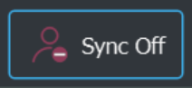

# Sync settings in the UI header

There are multiple settings that allow operations to be synced between each other, or between master and nodes. These are the ones available in the UI header.

### Sync volume and media visibility

For simplicity, you can chose to sync the fading of volume and visibility, such that they are both faded down or up when one of them is triggered. You can notice by the icon if syncing is *Off* (left image below) or *On* (right image below). 

{:width="47%"} &nbsp;&nbsp;&nbsp; {:width="47%"}

*Note: When pressing "Play" in C-Play the media visibility fades up automatically. So if syncing is on, then volume will do the same. In the settings, you can chose to fade down on Stop/rewind, which then fades down the media visibility, and then volume if this syncing is on.*

### Master to client(s) syncing

*In C-Play v2.2 and newer*

*In C-Play v2.1 and below*

{:width="20%"} &nbsp; {:width="20%"}

The button to the far right of the header is for the overall sync between master and the clients/nodes. Normally, this should always be *On*, but if you want to load, seek and alter many settings at ones, it can be useful to set *"Sync Off"*, and then turn it on when all things are done.

Keep in mind that audio playback is performed on the master, so if you wanted the media to keep playing on the nodes, while you load new media on the master, this will work with the video/image file, but not with the audio.

Also, the media visibility is the only property not effected by this state. That is always synced, no matter what.