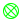
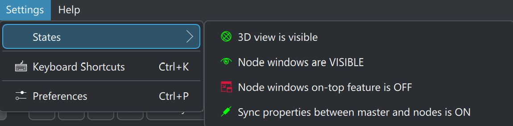
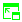
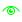

# Views

C-Play provides several view-related features for controlling how content is displayed, both on the master application and on networked display nodes.

###  3D View

The 3D view is an alternative visualization mode that renders your layers in a 3D scene instead of the standard flat playback view. This is useful for previewing how content will look when projected onto domes or spheres.

Toggle the 3D view on or off using the  (on) /  (off) globe button in the header taskbar.

The 3D view supports an interactive camera with orbit controls, letting you rotate around the scene to inspect your content from different angles.

#### Dome overflow masking

When working with dome-mapped content, you can hide the area that falls outside the dome projection. Enable *"Hide dome overflow in 3D view"* in the Window & UI settings. An opacity slider (0–100%) controls how strongly the overflow area is masked, allowing you to see a faint outline of the full content or hide it completely.

In [Window & UI settings](../settings/window_and_ui), you can choose to show the 3D view automatically when the application starts.

###  Floating window layer

The *floating window layer* feature provides a frameless floating window within your display for showing layer or video content in a secondary view. This is useful for picture-in-picture style monitoring while working with the main interface.

Toggle the floating window on or off using the  (on) /  (off) action in the header taskbar.

#### Configuration

The floating window position, size, and startup visibility can all be configured in the [Window & UI settings](../settings/window_and_ui):

* **Position** — X and Y coordinates for where the floating window appears.
* **Size** — Width and height of the floating window.
* **Visible at startup** — Whether the floating window is shown automatically when C-Play launches.

The floating window can toggle between displaying the main video layer and layer content, making it flexible for different monitoring workflows.

### View states

Except the 3D view explained above there is other view states.

#### Always on top

Toggle whether the node window stays above all other operating system windows using the *window on-top* action  (on) /  (off) in the header. The icon changes between a raised and lowered pip to indicate the current state.

This can also be set to activate at startup via *"Node windows always on top at startup"* in the [Window & UI settings](../settings/window_and_ui).

#### Opacity and fading

The node window opacity can be faded between fully visible (1.0) and fully hidden (0.0) using the *window opacity* action  (visible) /  (hidden). The fade animation duration is configurable in the Window & UI settings (default 2 seconds). While the window is in a partially transparent state, the action indicates *"TRANSPARENT"* with an  orange highlight.
