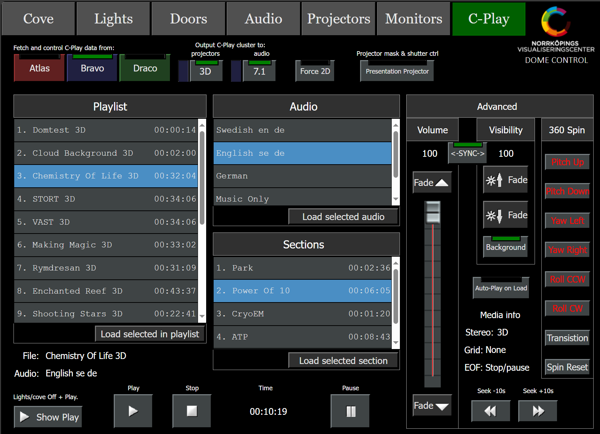

## C-Play iPad Control Interface

This UI, currently used in the Visualization Center C, is an example on how C-Play can be used with a remote UI. This exact one is specific to this site, but feel free to utilize a generic one, that can be found [here](https://github.com/c-toolbox/C-Play/tree/master/help/http_server).

### Guide to this "C-Play Dome Control" UI

 

1. Make sure C-Play is started on the cluster you want to use. There should be a desktop shortcut (*C-Play [Atlas]*, *C-Play [Bravo]* or *C-Play [Draco]*) on each master PC.

1. Select the cluster that C-Play runs on, for instance *Atlas* (as image above). When you press that button, the UI will check the connection to the master PC of that cluster, and fetch all data (current playlists, media file, volume level etc) from that master UI.

1. When the update/fetch is complete, feel free to chose any item in the playlist. When you have selected one, press the button named "*Load selected in Playlist*". You will notice the fields below and the lists named "*Audio*" and "*Sections*" will update after a few seconds.

1. If you want to change the language, do so in the "*Audio*" lists and if you want to jump to a certain part of a movie, do so in the "*Sections*" list. Select first, the press the *load* button below the list.

1. The press just press "*Play*" to start the playing the media.

* Optionally: You can choose to fade out both image and volume (or either of them), and then fade in them just before you play. There is also a button (top right) named "*Show Play*", that dims lights in the dome, fades up the video image and starts playing, all in one button press.

As seen in the image below, the data that was fetched in the remote UI above, comes from this master UI below:

 

## Advanced use cases

The remote UI contains some parts, that might not be used as much, which are important to explain.

### C-Play to dome (3D)

This button effectivly is a shortcut to switch the current selected C-Play state to either "*Atlas 3D*", "*Bravo 3D*" or "*Draco 3D*". Same as in the *Projectors* section. Notice you do not need to switch to "*Atlas 2D*", "*Bravo 2D*" or "*Draco 2D*" with C-Play, as it can handle 3D and 2D content correctly without this switching.

### 3D -> 2D

The button named "*3D -> 2D*", FORCES even 3D content to show as 2D content. This is the button you want to use, when you want show a 3D movie in the dome, without the use of 3D glasses. *You want to disable this one to make it 3D correct again.*

### Background

This button enabled and disables the background, if you would like the dome to fade to black or the background image, when you want to hide the video.

### Presentation Projector

This opens and closes the shutter of the presentation projector, but also, puts a black mask on-top of the c-play content, that corresponds to the projected footprint on the dome of the presentation projector. Such that you could have a powerpoint in the middle of the dome from a laptop, while also having content around which is shown by the dome projectors.

### 360 Control

C-Play support 360 movies and images (2D and 3D). However, in the dome, the content shown of that video is usually only half of that. To create a interactive moment of the 360 video, to show another side, there is convience button to rotate the sphere around, and also transition the sphere to another defined state (see "*Settings -> Configure -> Mapping & Image*" do change this state.)

