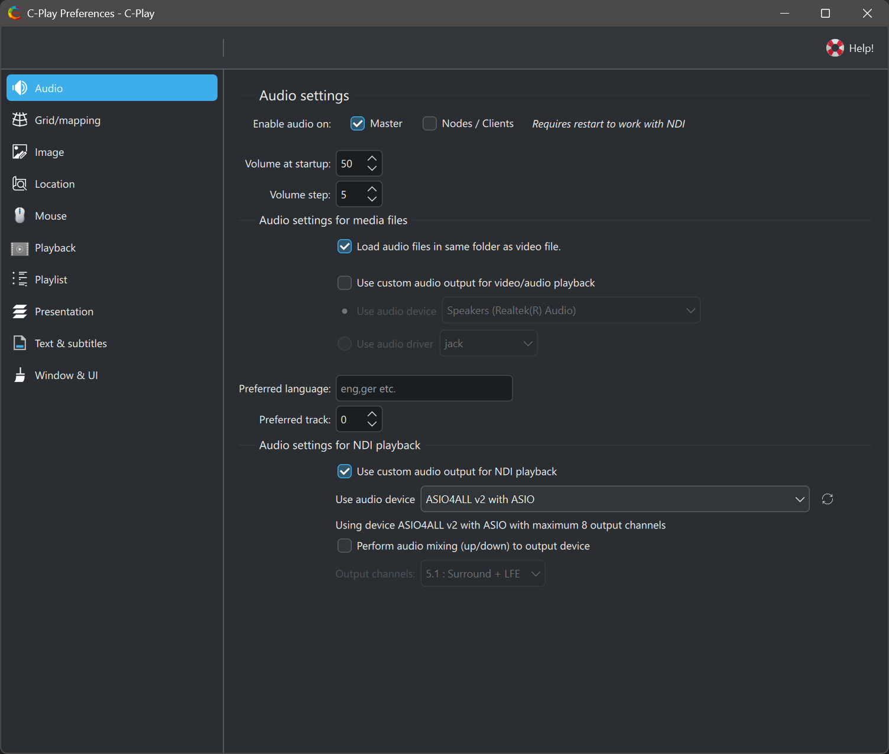

# Audio settings

 

The audio settings within C-Play let you configure audio output devices, volume behavior, and track preferences.

### General

* **Enable audio on master** — Enable audio playback on the master application (default on).
* **Enable audio on nodes** — Enable audio playback on cluster nodes (default off).
* **Volume at startup** — Initial volume level when C-Play starts (0–100, default 100).
* **Volume step** — How much the volume changes per increment in the UI (0–100, default 5).

### Audio output

If *"Use custom audio output"* is not selected, C-Play uses the system default audio device.

* **Use custom audio output** — Enable manual selection of audio output (default off).
* **Use audio device** — Target a specific audio device from the detected list.
* **Use audio driver** — Target an audio driver instead (jack, openal, oss, pcm, pulse, wasapi).
* **Preferred audio output device** — The selected device name.
* **Preferred audio output driver** — The selected driver name.

For multi-channel audio setups such as JACK, see the [Audio configuration guide](../setup/audio).

### Audio track preferences

* **Load audio files in same folder** — Automatically load adjacent audio files as additional tracks when opening a video (default on).
* **Preferred language** — IETF language tag for preferred audio track language (e.g. `eng`, `ger`).
* **Preferred track** — Preferred audio track number. Leave at 0 for automatic selection.

### NDI audio output (requires NDI support)

From C-Play v2.1 and onwards, NDI is supported as a layer within a slide. There is a specific audio configuration for NDI audio playback on master.

OMT layers do not use these settings. In the current C-Play implementation, OMT support is limited to video frames and no audio is received yet.

* **PortAudio custom output** — Enable a custom PortAudio device for NDI audio (default off).
* **PortAudio output device** — Select the PortAudio output device.
* **PortAudio output API** — Select the PortAudio host API.
* **Mix input to output** — Mix NDI audio input directly to the selected output (default off).
* **Output channels** — Number of audio output channels: 2.0, 2.1, 5.0, 5.1, 7.0, or 7.1 (default 6 / 5.1).
