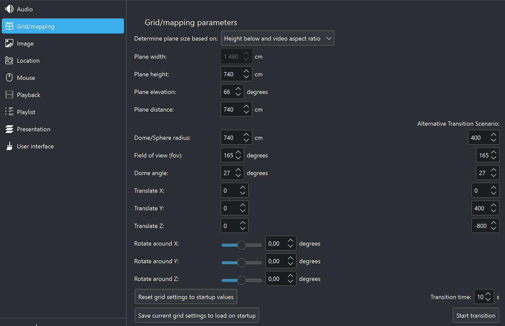

# Grid/mapping settings

 

The grid/mapping settings within C-Play handles the objects where texture mapping occur on for all media, where objects such as planes (for flat media), dome (fulldome/fisheye content) and sphere (for equirectangular and equi-cubemaps) are used for media with various projections.

As seen, you need to standardize where the normal plane for showcasing flat media should be, as well as how big the dome and/or sphere should be that we map that media on.

As seen, there is and *"Alternative Transition Scenario"*, which can be set which will transition/scale the dome and/or sphere to another mode. Thus we could actually map a media inside of a sphere and place the camera (ourself) inside of it, and then move outwards of the sphere to see the mapping of it from the outside. Whenever new media with another *"Grid mode"* is loaded, for instance loading a dome movies after a spherical movie, these values are reset to standard startup values.