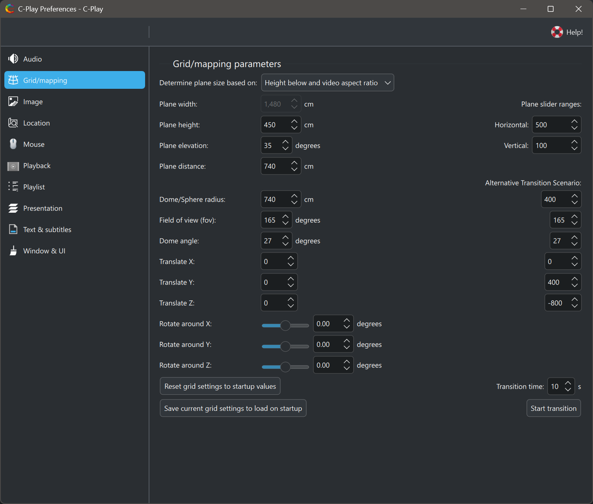

# Grid/mapping settings

 

The grid/mapping settings within C-Play control the geometry used for texture mapping of all media. Objects such as planes (for flat media), domes (fulldome/fisheye content), and spheres (for equirectangular and equi-angular cubemap content) are used depending on the projection type.

### Plane settings

These define the default plane geometry for flat media:

* **Calculate size based on video** — When enabled, the plane dimensions are derived from the video resolution. When disabled, manual width/height values are used (default on).
* **Plane width** — Width of the plane in centimeters (default 1480).
* **Plane height** — Height of the plane in centimeters (default 740).
* **Plane elevation** — Vertical tilt angle in degrees (default 39).
* **Plane distance** — Distance from the camera in centimeters (default 740).
* **Horizontal slider range** — Maximum horizontal range in centimeters for plane positioning (default 5000).
* **Vertical slider range** — Maximum vertical range in centimeters for plane positioning (default 5000).

### Dome and sphere settings

* **Radius** — Radius of the dome or sphere in centimeters (0–20000, default 740).
* **Field of view** — Angular field of view in degrees (0–360, default 165).
* **Dome angle** — Tilt angle of the dome in degrees (0–360, default 27).
* **Rotation X / Y / Z** — Default rotation offsets around each axis in degrees (default 0 for all).
* **Translate X / Y / Z** — Default translation offsets along each axis (default 0 for all).

### Alternative transition scenario

An alternative set of dome/sphere parameters can be defined for transitioning between two states. For example, you can start inside a sphere and transition to an outside view.

* **Radius (2nd state)** — Target radius (default 400).
* **Field of view (2nd state)** — Target field of view (default 165).
* **Dome angle (2nd state)** — Target dome angle (default 27).
* **Translate X / Y / Z (2nd state)** — Target translation offsets (defaults: 0, 400, -800).
* **Transition time** — Duration of the transition in seconds (0–20, default 10).

Whenever new media with a different grid mode is loaded, these values reset to the standard startup values.

### Surface rotation speed

* **Rotation speed** — Speed multiplier for runtime rotation controls (default 0.01).