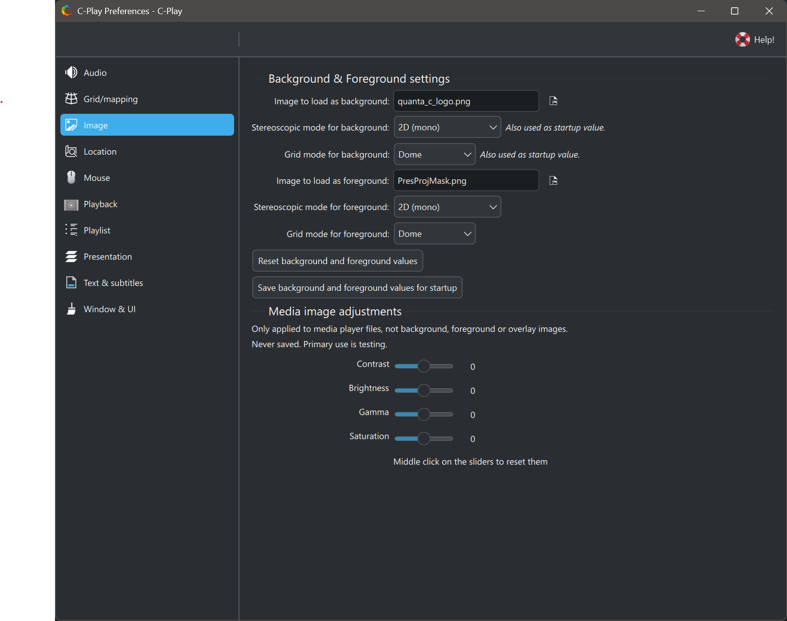

# Image settings

 

The image settings within C-Play control the background and foreground images that frame the standard media playback area. These are typically used to provide a persistent environment backdrop (e.g. a dome background) or an overlay.

### Background image

* **Image file** — Path to the image loaded behind the main media. At startup the background is loaded and visible.
* **Stereoscopic mode** — Stereo format of the background image: 2D (mono), 3D side-by-side, 3D top-bottom, or 3D top-bottom+flip (default 2D).
* **Grid mode** — Mapping mode for the background: None (pre-split), Plane, Dome, Sphere EQR, or Sphere EAC (default None).

### Foreground image

* **Image file** — Path to the image loaded in front of the main media. At startup the foreground is hidden.
* **Stereoscopic mode** — Stereo format of the foreground image (same options as background, default 2D).
* **Grid mode** — Mapping mode for the foreground (same options as background, default None).

As these images are meant to be standardized for your environment, only change them when you intend to update the default. Remember not to save if the change is unintended for the next startup.

### Image adjustments

These sliders let you adjust properties of the currently loaded media image for testing purposes:

* **Contrast**
* **Brightness**
* **Gamma**
* **Saturation**

These values are **not saved** between sessions. They are intended for live testing of content in your environment rather than as persistent settings.