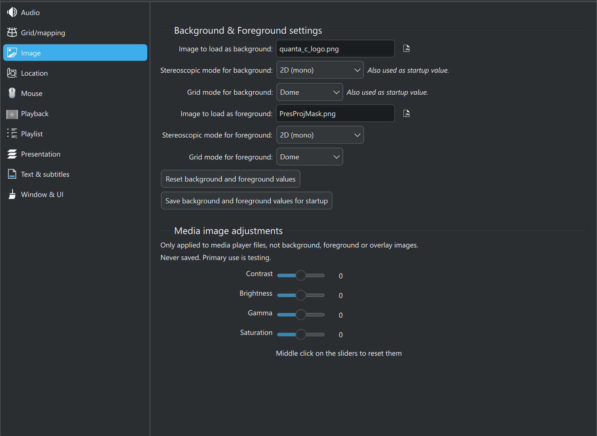

# Image settings

 

The image settings within C-Play revolve primarily in choosing the background and/or foreground image, which can be used behind and above the standard general media loading/playback, usually access through "*Open File*" or in a playlist.

At startup, the background is loaded, while the foreground is hidden.

As it is not normal to change background or foreground, as this it ment to be standardized use in your environment, you change these only in this setting. So remember do not save these if it not attended to be default at next startup.

You can also change the image contrast, brightness, gamma and saturation. This is intended to be used for images/video loaded by the user, to find a system setting. These values will never be saved for use in next startup, as it's more intended to let you test content changes in your environment, more then to be an overall setting.