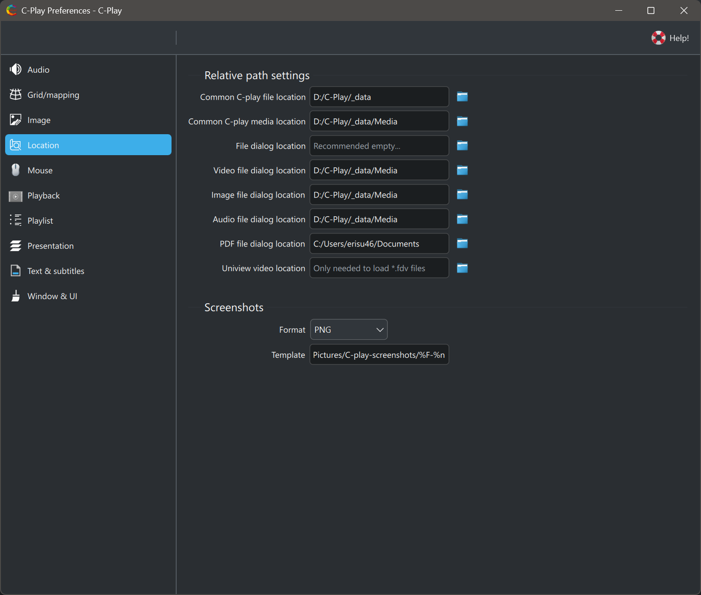

# Location settings

 

There are several optional file locations you can set that simplify file management in C-Play.

These are found in "Settings -> Configure -> General".

#### 1. Common C-play file location (recommend to set)

This is the folder that you preferably store all saved "*.cplayfile*" and "*.cplaylist*" files. When this folder is set it will be used as the default folder for saving of these files, as well as when adding already saved "*cplayfile(s)*" to the playlist. A "*.cplaylist*" will also use relative path to "*.cplayfile(s)*" when this is set.

#### 2. Common C-play media location (recommend to set)

The base location where your media is stored. The benefit of setting this path is that when you save a "*cplayfile*", the paths to media, audio, overlays, and so on will be relative. This simplifies moving content across drives if necessary.

#### 3. File dialog location (recommended empty)

The file dialog location can be set to a preferred path that C-Play will always open when clicking "*Open File*". By default, this is *empty*, and C-Play instead opens the last path you loaded a file from.

#### 4-7. Default file location for various *layer* types (from C-Play v2.1 and newer)

There are specific file location settings for various file dialogs used with the *Layer* functionality introduced in C-Play v2.1. They are normally set to the file type specific path in Windows (for video, pictures, music and documents(for PDF:s)). However, please feel free to change this depending how you store files on your cluster.

#### 8. Uniview video location (legacy)

C-Play supports loading Uniview "*.fdv*" files for use in an environment where Sciss Uniview is running alongside it, or has been used before. Those paths are relative by nature, so C-Play needs to know where Uniview looks for the video files, which should be this path. Still, it is highly recommended to move toward using only "*cplayfile*" and "*cplaylist*", which are both easy to use in C-Play and more powerful.

#### Screenshots

* **Screenshot path** — The folder where screenshots are saved. Default is the system pictures folder under `C-play-screenshots/`.
* **Buffer source** — Choose which rendering stage to capture:
  * *Before Warping and Blending* — captures the undistorted frame (front buffer).
  * *After Warping and Blending* — captures the final output as displayed (back buffer).
* **Take Screenshot** — Captures a screenshot on all cluster nodes and saves it to the configured path.
