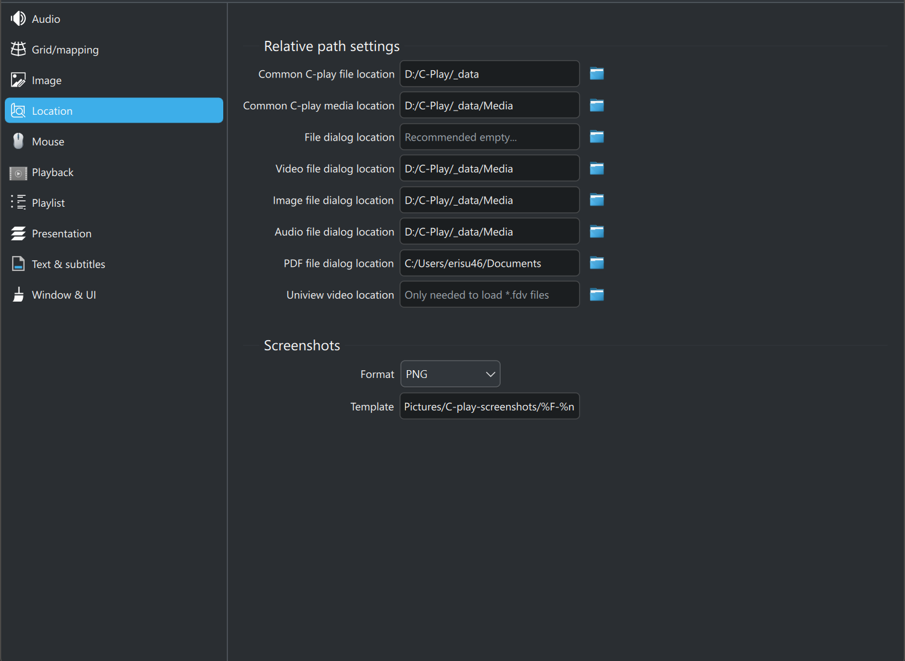

# Location settings

 

There are several optional file location you can set, that simplifies file management in C-Play.

These are found in "Settings -> Configure -> General".

#### 1. Common C-play file location (recommend to set)

This is the folder that you preferably store all saved "*.cplayfile*" and "*.cplaylist*" files. When this folder is set it will be used as the default folder for saving of these files, as well as when adding already saved "*cplayfile(s)*" to the playlist. A "*.cplaylist*" will also use relative path to "*.cplayfile(s)*" when this is set.

#### 2. Common C-play media location (recommend to set)

The base location of where your media is stored. The benefit of setting this path is that when you save a "*cplayfile*" the path to media, audio, overlay etc will be relative. To simplify moving of content across drives if necassary.

#### 3. File dialog location (recommended empty)

The file location path could be set to hold a preferred path for which C-Play will always open it dialog to when clicking "*Open File*". But as default, this is *empty*, and C-Play then opens the last path you loaded a file from.

#### 4. Uniview video location (legacy)

C-Play supports loading of Uniview "*.fdv*" files, for utilizing C-Play within an environment that has Sciss Uniview runnning alongside it, or that has been used before. Does path are relative by nature, so C-Play needs to now where Uniview looks for the video files, which should be this path. Though, it is highly recommend to start using only "*cplayfile*" and "*cplaylist*", which is very easy in C-Play, and also more powerful. 
