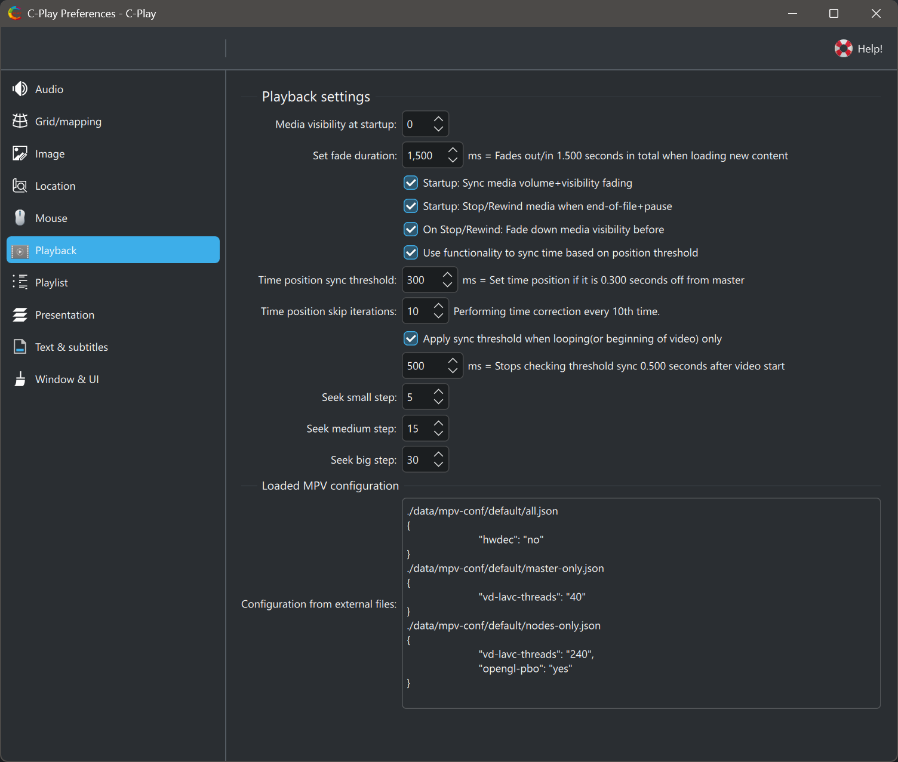

# Playback settings

 

The playback settings within C-Play control fading, visibility, seeking, and time synchronization behavior.

### Visibility and fading

* **Media visibility at startup** — Initial media visibility level (0–100%, default 100).
* **Fade duration** — Time in milliseconds for fade up/down transitions (0–20000, default 2000).
* **Sync volume and visibility fading** — When enabled, volume and visibility fade together (default off).
* **Rewind on EOF when paused** — Rewind to start when end-of-file is reached while paused (default off).
* **Fade down before rewind** — Fade visibility down before rewinding (default off).

### Seek steps

These control how far seeking jumps in seconds for each step size:

* **Small step** — Seconds per small seek (0–100, default 5).
* **Medium step** — Seconds per medium seek (0–100, default 15).
* **Big step** — Seconds per big seek (0–100, default 30).

### Time synchronization

These settings control how playback time is kept in sync between master and nodes. Tuning depends on your system performance.

* **Use threshold to sync time position** — Enable threshold-based time sync (default on).
* **Time position sync threshold** — Maximum allowed time drift in milliseconds before a sync correction is triggered (100–5000, default 100).
* **Time position skip iterations** — Number of sync check iterations before forcing a skip (1–500, default 10).
* **Apply threshold sync on loop only** — Only apply threshold sync when looping (default on).
* **Time to check threshold after loop** — Delay in milliseconds after a loop before checking sync (0–20000, default 500).

### MPV configuration

The currently loaded MPV configuration is displayed at the bottom of this page (read-only). For more details on how MPV configuration affects playback, see the [Video configuration guide](../setup/video).