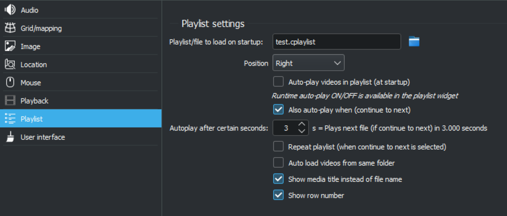

# Playlist settings

 

The playlist settings within C-Play let you choose a startup file playlist. In practice, this could even be a media file that is played as well, but that is not the intended use.

You can also decided on which side you want the playlist and section interface to located.

*Auto-play* can be set as default in this setting (at startup), however it can also be controlled during runtime from the playlist interface. Also decide how many seconds after a file has been loaded that play should start. Depending on your system, the files might take some time to load on all nodes, so this time should (at least) reflect that time that you need to wait for loading to be complete.

The *"Auto load vides from same folder"* is disabled by default, and should only be used in special cases. If enabled, it will load all media files in that folder, clear the current playlist and put all these new files into an ordered playlist.