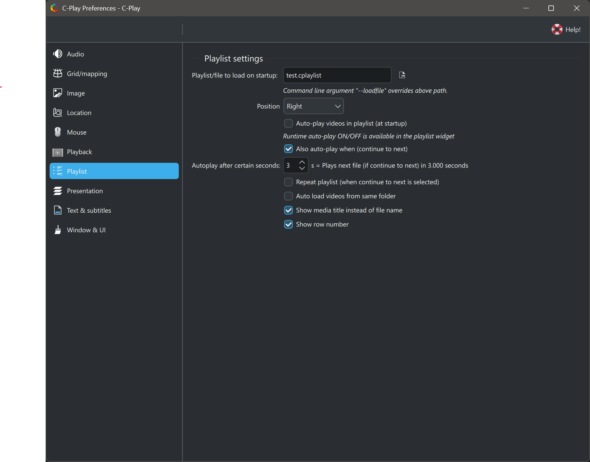

# Playlist settings

 

The playlist settings within C-Play control startup behavior, layout, and auto-play options for the playlist.

### Startup

* **Playlist/file to load on startup** — Path to a *.cplaylist*, *.cplayfile*, or media file to load automatically when C-Play starts. Leave empty for none. *Note: The command line argument `--loadfile` takes precedence over this setting.*

### Layout

* **Position** — Which side of the screen the playlist and section interface appears on: *Left* or *Right* (default Right).
* **Show media title** — Display the media title in playlist entries (default on).
* **Show row number** — Display row numbers in the playlist (default on).

### Auto-play

* **Auto-play on load** — Automatically start playing when a file is loaded (default off). This can also be toggled at runtime from the playlist interface.
* **Auto-play next** — Automatically advance to the next item when the current one finishes (default on).
* **Auto-play after time** — Seconds to wait after a file has loaded before starting playback (0–10, default 3). Set this high enough to allow all nodes to finish loading.

### Behavior

* **Repeat** — Loop the playlist when the last item finishes (default off).
* **Load siblings (auto load videos from same folder)** — When enabled, loading a media file will also load all other media files from the same folder into the playlist (default off). Use only in special cases.