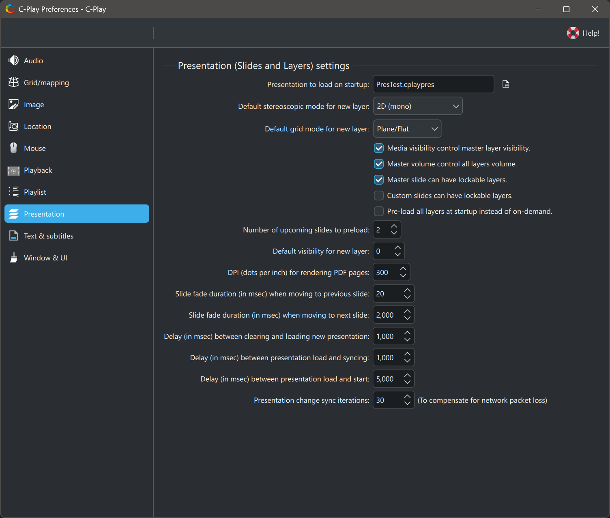

# Presentation settings (C-Play v2.1 and newer)

 

The presentation settings within C-Play control defaults for layers, slide behavior, and timing for the presentation system.

### Startup

* **Presentation to load on startup** — Path to a *.cplaypres* file loaded automatically when C-Play starts. Leave empty for none.

### Layer defaults

These defaults are applied when adding new layers. Each layer can be changed individually after creation.

* **Default stereoscopic mode** — Stereo format for new layers: 2D (mono), 3D side-by-side, 3D top-bottom, or 3D top-bottom+flip (default 2D).
* **Default grid mode** — Mapping mode for new layers: None (pre-split), Plane, Dome, Sphere EQR, or Sphere EAC (default Plane).
* **Default visibility** — Initial visibility percentage for new layers (0–100, default 0).

### Master control

* **Media visibility controls master layer visibility** — When enabled, the primary media visibility (from "Open file" or the playlist) controls the fade in/out and start/stop of master layers (default on).
* **Master volume controls all layers volume** — When enabled, changing the master volume in the header also affects all layer volume levels, applied as a percentage of each layer's individual maximum (default on).

### Lockable layers

* **Master slide can have lockable layers** — Allow layers in the master slide to be locked (default off).
* **Custom slides can have lockable layers** — Allow layers in custom slides to be locked (default off).

### Pre-loading

* **Pre-load all layers** — Pre-load all layers at startup (default off). In most cases it is recommended to use the *Preload Layers* button in the Slides toolbar instead.
* **Number of upcoming slides to preload** — How many upcoming slides to load ahead when triggering a slide, for smoother transitions (0–10, default 2).

### PDF rendering (requires Poppler support)

* **DPI (dots per inch) for rendering PDF pages** — Resolution for PDF page rendering (0–1000, default 300).

### Timing

All timings are in milliseconds:

* **Fade duration to previous slide** — Fade time when moving backwards in the slide deck (20–20000, default 20).
* **Fade duration to next slide** — Fade time when moving forwards in the slide deck (20–20000, default 2000).
* **Clear and load delay** — Delay between clearing the old presentation and loading a new one, to allow nodes to clear first (0–20000, default 1000).
* **Sync after load delay** — Delay after loading before syncing, to wait for layers to be ready (0–20000, default 1000).
* **Start after load delay** — Delay after loading before starting playback, if layers are visible at startup (0–20000, default 5000).
* **Presentation change sync iterations** — Number of network sync iterations when changing presentations (0–20000, default 30).