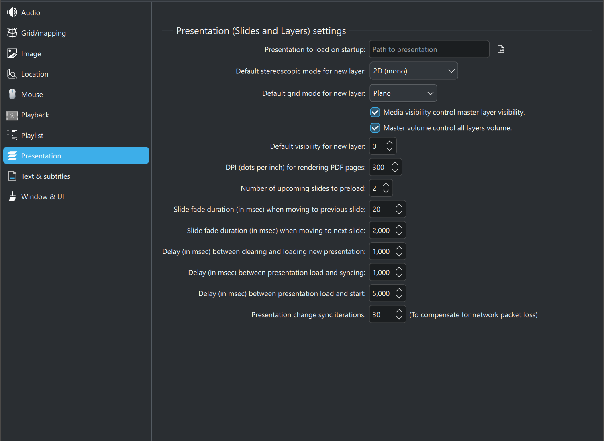

# Presentation settings (C-Play v2.1 and newer)

 

The presentation settings within C-Play let you first choose if you want to have a startup presentation when the program starts up. If you leave this field empty, no presentation will be loaded at startup.

You can then select the default grid and stereoscopic mode for new layers (after a layer has been added, this can of course be changed for every layer). Further down also the default visibility can be set which is applied for new layers.

The settings *Media visibility control master layer visibility* feature works such that when enabled, the primary media visibility, loaded through "Open file" or the playlist, controls the visibility of master layers, such that they fade in/out respectively and also start/stop depending on this visibility.

The setting *Master volume control all layers volume*  applies that changing the master volume in the UI header will also control all volume levels on the layers. Note that the master will function as a percentage of the maximum volume you have specified for each individual layer.

The setting *DPI (dots per inch) for rendering PDF pages* corresponds obviously to the output resolution of PDF:s when rendered onto the screen.

The setting *Number of upcoming slides to preload* is used when running through slides. When triggering a slide the number of upcoming slides in this setting will also be loaded, for a smoother fade when later triggering this slide. In most circumstances it is recommended to use the setting *Preload Layers* within the *Slides* toolbar to actually pre-load all slides before starting to use the presentation.

The last five setting all involve various timings (in milliseconds) for various parts of the presentation cycle, which are:

* Fade duration when moving backwards in the slide deck
* Fade duration when moving forwards in the slide deck
* Delay between old and new presentation load (such that it can be cleared on the nodes before new ones are added.)
* Delay between load and sync (to wait for things to get ready)
* Delay between load and start (if some layers are visible at startup).