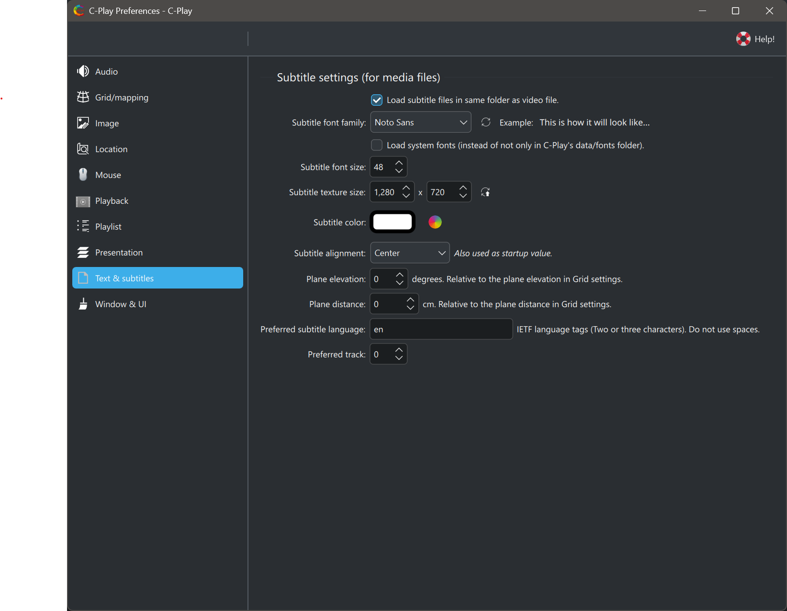

# Text & subtitles (C-Play v2.2 and newer)

These settings control how subtitles and on-screen text are rendered in C-Play. Changes are applied immediately and saved to the configuration file.

### Font

* **Font family** — Select the font used for subtitle rendering from the dropdown. By default, only bundled fonts are listed. Click *"Update Font List"* to refresh available fonts.
* **Load system fonts** — When enabled, system-installed fonts are included in the font list alongside the bundled fonts.
* **Font size** — Size of the subtitle text in points (0–500, default 48).

A preview of the selected font is shown below the font controls.

### Color and alignment

* **Subtitle color** — Click the color rectangle to open a color picker and choose the subtitle text color. The current color is shown as a hex code (default `#FFFFFF`).
* **Alignment** — Choose between *Left*, *Center* (default), or *Right* text alignment.

### Texture / render size

The subtitle text is rendered to an internal texture before being composited onto the video. You can control the resolution of this texture:

* **Width** — Texture width in pixels (32–8192, default 1280).
* **Height** — Texture height in pixels (32–8192, default 720).

Click *"Update text texture/render size"* to apply resolution changes.

Higher values produce sharper text at the cost of more GPU memory. Match these to your output resolution for best results.

### Plane positioning

These settings adjust where the subtitle plane is positioned in 3D space relative to the current grid mapping:

* **Elevation** — Vertical offset in degrees (-360 to 360, default 0). Useful for moving subtitles up or down relative to the dome/sphere grid.
* **Distance** — Distance offset in centimeters (-20000 to 20000, default 0). Moves the subtitle plane closer to or further from the viewer.

### Subtitle loading

* **Load subtitle files in video folder** — When enabled (default), C-Play automatically loads `.srt` and `.ass` subtitle files found in the same directory as the currently playing video.
* **Preferred language** — IETF language tag(s) for the preferred subtitle language (e.g. `eng`, `ger`). Multiple tags can be comma-separated.
* **Preferred track** — Preferred subtitle track number. Set to 0 for automatic selection.