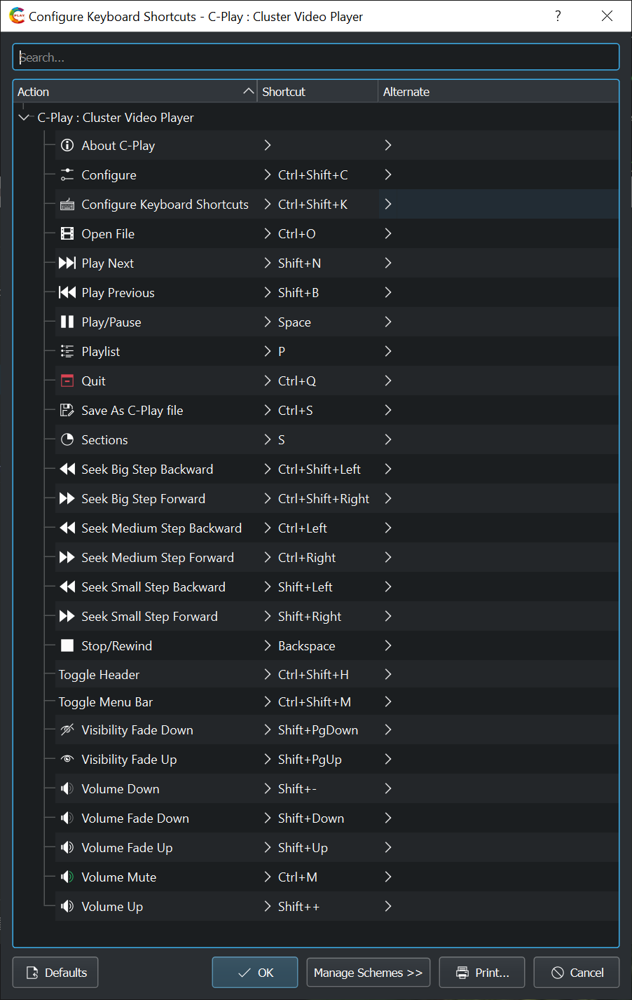

# UI + Mouse + Keyboard shortcuts

The settings for the user interface, mouse buttons and keyboard shortcuts should be straight-forward to understand. Below you find reference images of these controls, which can be useful if you have hidden the *MenuBar* and/or *Header* and forgotten the keyboard shortcuts to bring them back.

{:width="57%"} &nbsp; {:width="37%"}

 