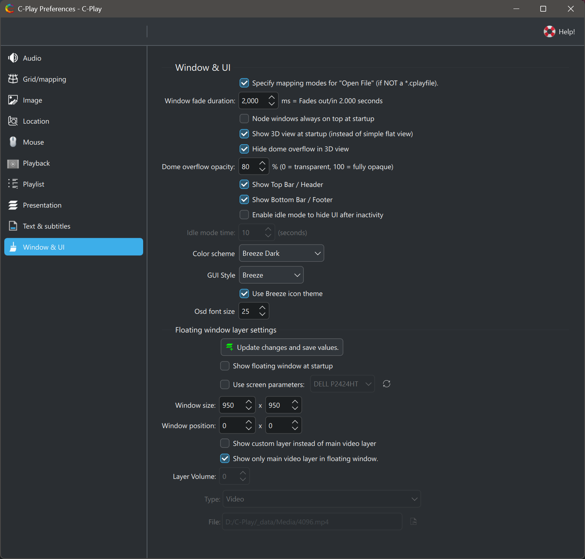

# Window and UI settings  (C-Play v2.2 and newer)

These settings control the appearance, layout, and behavior of the C-Play user interface.

### On-screen display (OSD)

* **OSD font size** — Font size in points for on-screen information overlays such as chapter skip messages (0–100, default 25).
* **Show OSD on skip chapters** — When enabled (default), a brief message is shown on screen when skipping between chapters.

### Header and footer visibility

* **Show top bar / header** — Toggle visibility of the top header bar containing playback controls and menus (default on).
* **Show bottom bar / footer** — Toggle visibility of the bottom footer bar containing the timeline and media info (default on).

### Idle mode

When idle mode is enabled, the UI automatically hides after a period of inactivity, giving a clean full-screen view of the content.

* **Enable idle mode** — Turn idle auto-hide on or off (default off).
* **Idle time** — Seconds of inactivity before the UI hides (1–3600, default 60).

### 3D view

* **Show 3D view at startup** — Automatically open the 3D visualization mode when C-Play launches (default off).
* **Hide dome overflow in 3D view** — Mask content that falls outside the dome projection area (default off).
* **Dome overflow opacity** — Opacity of the dome overflow mask, from 0% (transparent) to 100% (fully opaque). Default 70%.

### Node window behavior

* **Node windows always on top at startup** — Keep node display windows above all other OS windows when the application starts (default off).
* **Window fade duration** — Duration in milliseconds for fade-in and fade-out animations on the node window (0–20000, default 2000). Shown in the UI as seconds.

### Open file behavior

* **Show mapping mode on open file** — When opening non-`.cplayfile` files, prompt for the grid mapping mode to use (default on).

### Theme and appearance

* **Color scheme** — Select the color theme for the application (e.g. *Breeze Dark*, *Breeze Light*, *Breeze High Contrast*). Loaded from the available color scheme files.
* **GUI style** — Select the Qt platform style (e.g. *Breeze*). Available styles depend on your system.
* **Use Breeze icon theme** — Use the Breeze icon set. Changing this requires an application restart.

### Floating window

The floating window is a frameless secondary window for displaying content in a picture-in-picture style. It can show either the main video layer or a custom layer source.

#### Content selection

* **Show main video layer** — When enabled (default), the floating window mirrors the main video. Disable to select a custom layer instead.
* **Show only main video in layer** — When showing the main video, display only the video without additional layer compositing (default on).
* **Custom layer type** — Choose a layer source type: *File*, *NDI*, *Spout*, *Stream*, or *Text*.
* **Custom layer path** — The file path, NDI sender name, Spout sender, stream URL, or text content for the custom layer.
* **Volume** — Audio volume for the custom layer (0–100%, default 100).

#### Position and size

* **Screen** — Select which display monitor the floating window appears on, from detected screens.
* **Use screen parameters** — Position the window according to the selected screen's coordinates (default on).
* **Width** — Window width in pixels (32–8192, default 640).
* **Height** — Window height in pixels (32–8192, default 360).
* **Position X** — Horizontal position in pixels (-8192 to 8192, default 80).
* **Position Y** — Vertical position in pixels (-8192 to 8192, default 140).

#### Startup

* **Visible at startup** — Automatically show the floating window when C-Play launches (default off).

Click the *"Update"* button after changing floating window settings to apply them. The button turns orange while changes are pending and lime once saved.