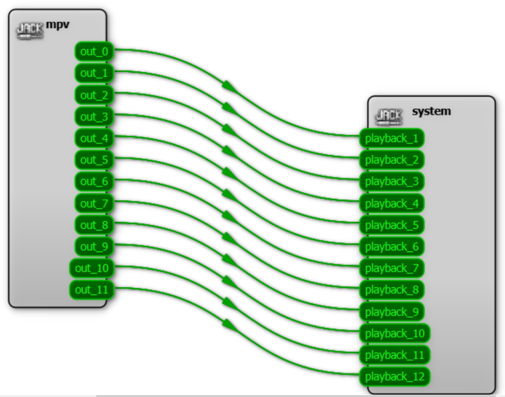

# Audio output in C-Play

As C-Play has embedded [MPV](https://mpv.io/) as it media player backend, C-Play support whatever MPV support in terms of audio files.

The audio output device you want C-Play to use can be configured in "Settings -> Configure -> Audio".

You can choose to either use a custom audio device that MPV has detected, or to go for a specific audio driver.

## Native, up to 8 channels

C-Play is a "*Windows only*" application, and as such, is partially limited by the native capabilities of Windows when it comes to audio output. You should expect C-Play to find any device output you have connected. However, native Windows audio support up to 8 channels of output (such as 7.1) without the use of any additional third-party solution.

However, C-Play was designed with the intention of supporting much more audio channels, and a such C-Play is capable of using the "*JACK*" if you need above eight channels.

## JACK, low latency up to 64 or 128 channels

In C-Play, the MPV and ffmpeg library, that are utilzied as the backend for video and audio decoding, is compilied together with the cross-platform audio API named [JACK](https://jackaudio.org/).

As C-Play is a Windows only application, please follow this [guide](https://jackaudio.org/faq/jack_on_windows.html) on how to install it and set it up on the Windows machine that you want to use as C-Play master.

The application "*QJackCtl*" that should run in the background/tray (this configuration can be made in the program) and prefarably at startup of the computer, is the one that will act as a bridge between C-Play (through mpv) and your capable audio device (which might have up to 128 channels). 

In "*QJackCtl*", you can configure it to a specifc driver, such as the competent low-latency ASIO driver (if your audio device supports that), as well how many channels you want it to show in the "*graph*". For instance, if you specifed 12 channels, you should see 12 channels in the graph, named "playback_**".

When C-Play loads a audio file, you should see how many channels it has by how many channels that are connect in the graph, as seen below.

 

## Naming of external files

In a show environment, is benefical to not have different video files for every movie, and as C-Play support loading of audio files that sit next to the video file (i.e. "*side-loading*"), it is very beneficial to use that capability to always add additional tracks as new files, the sits next to the video file on the master machine.

C-Play also has [REST API](../../api.md) that support retrieval of the audio track that are embedded or ar "*side-loaded*", such that the user could trigger the change of a different audio track, if desired. To not mix-up different audio files for different video files, it is good practice to name the audio file with at least the start of the same filename, and an end of the specific language or track name.

So, if your video would be named "*Awesome_4K_3D_H265_video.mp4*", you should for instance name your english and swedish tracks "*Awesome_English.wav*" and "*Awesome_Swedish.wav*".

While the C-Play GUI itself will show the complete name, to make it very clear which file is loaded, the [REST API](../../api.md) can be configured to omit the first name such that you playback UI for host or operators with a tablet or a phone, just see the tracks named "*English*" or "*Swedish*", without the prefix video name.