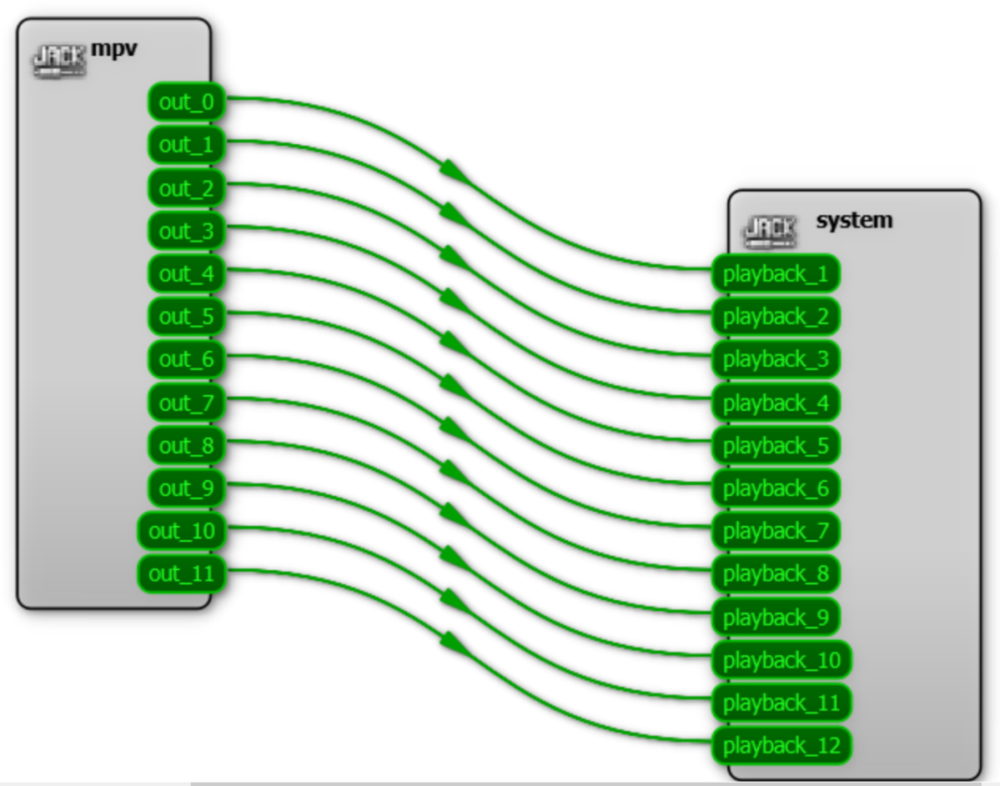

# Audio configuration

C-Play embeds [MPV](https://mpv.io/) as its media player backend, so it supports the audio formats that MPV supports.

MPV also has its own feature-rich configuration system for both video and audio processing. Several audio-related settings can be made in the MPV configuration files, which are described more extensively in the [Video configuration guide](video#mpv-configuration-files). This includes settings such as [*audio-spdif*](https://mpv.io/manual/master/#options-audio-spdif) for passthrough of certain audio formats directly to your audio system.

## Audio output in C-Play

The audio output device you want C-Play to use can be configured in "Settings -> Configure -> Audio".

You can choose to either use a custom audio device that MPV has detected, or to go for a specific audio driver.

### Native, up to 8 channels

C-Play is a "*Windows only*" application, and as such, is partially limited by the native capabilities of Windows when it comes to audio output. You should expect C-Play to find any device output you have connected. However, native Windows audio support is normally limited to up to 8 channels of output, such as 7.1, without the use of any additional third-party solution.

However, C-Play was designed with the intention of supporting many more audio channels, and as such it is capable of using *JACK* if you need more than eight channels.

### JACK, low latency up to 64 or 128 channels

In C-Play, the MPV and FFmpeg libraries used as the backend for video and audio decoding are compiled together with the cross-platform audio API [JACK](https://jackaudio.org/).

As C-Play is a Windows only application, please follow this [guide](https://jackaudio.org/faq/jack_on_windows.html) on how to install it and set it up on the Windows machine that you want to use as C-Play master.

The application *QJackCtl*, which should run in the background or tray and preferably at startup, acts as the bridge between C-Play, through MPV, and your audio device, which might have up to 128 channels.

In *QJackCtl*, you can configure a specific driver, such as the low-latency ASIO driver if your audio device supports it, as well as how many channels you want it to show in the *graph*. For instance, if you specify 12 channels, you should see 12 channels in the graph, named "playback_**".

When C-Play loads an audio file, you should see how many channels it has by how many channels are connected in the graph, as seen below.

 

## Naming of external files

In a show environment, it is beneficial not to have different video files for every movie. Since C-Play supports loading audio files that sit next to the video file, that is, *side-loading*, it is useful to add additional tracks as separate files next to the main video file on the master machine, or on the node if C-Play is configured to run audio from nodes.

C-Play also has a [Web API](../remote/api) that supports retrieval of the audio tracks that are embedded or *side-loaded*, so the user can trigger a change to a different audio track if desired. To avoid mixing up audio files for different video files, it is good practice to name the audio file with at least the start of the same filename, followed by the specific language or track name.

So, if your video is named "*Awesome_4K_3D_H265_video.mp4*", you could name your English and Swedish tracks "*Awesome_English.wav*" and "*Awesome_Swedish.wav*".

While the C-Play GUI itself will show the complete name, the [Web API](../remote/api) can be configured to omit the filename prefix so a playback UI for hosts or operators on a tablet or phone can simply show tracks named "*English*" or "*Swedish*".