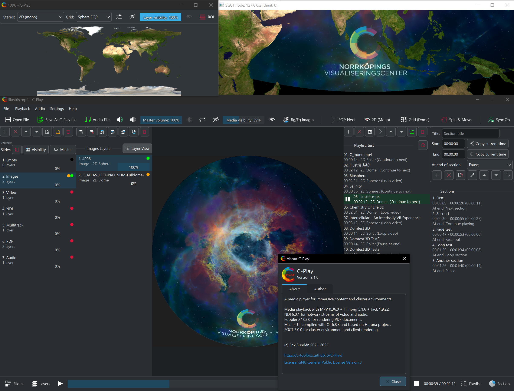

# C-Play : Cluster Media Player

C-Play is a video/media player developed for cluster environments where you need multiple computers and/or displays to run your content on. The displays could be flat or curved in any setup that is supported by our underlying toolkit [SGCT](https://sgct.github.io/) and any media format supported by [MPV](https://mpv.io/).

## Latest Release Version: 2.1

### Content features
These are just some features that set C-Play apart from others media/video players:

C-Play support media that is:

- Stereoscopic (Side-by-side or Top-Bottom) and Monoscopic

- 180 fulldome / fisheye

- 360 equirectangular or equiangular cubemap (common on YouTube)

- Any "flat" media arbitary aspect ratio

Media can be added as layers within slides, using numerous inputs, such as 

- *Images* (JPG and PNGs)

- *PDF* (Common export format from PPT)

- *Videos* (H264, HEVC/H265, AV1/H266, VP9 etc) 

- *Audio* (WAV, AAC etc)

- *NDI* (Live streams form local network)

- *Streams* (Youtube etc supported through FFmpeg)

 With above layers, you can  make it as easy as using powerpoint to create an immersive presentation.

### Technical features:

- Runs a QT/QML UI application on master computer and small none-UI GLFW/SGCT application on clients.

- Sync playback, loading and other properties between master and clients.

- Playing audio is only available on master *(Support for node audio is added in 2.2, currently in beta)*. Change of audio output is supported, and C-Play is pre-built with "JACK", which opens for multi-channel low-latency output to for instance ASIO devices.

- Loading external audio files as multiple tracks.

- Editing and saving playlist and playfiles including all necassary parameters.

- Configure "sections" in a editor to create bookmarks to jump between clips inside a larger movie.

- Sync video+audio fade in/out

- HTTP Web API

- Tested and used on primarily Windows 10, in domes and other big arenas.

## Guides
1. [Install C-Play](install)
1. [Setup C-Play](setup)
1. [Media structure](media)
1. [Settings](settings)
1. [Playback features](playback)
1. [Remote control](remote_control)
1. [Build from code](build)

## Launcher
To launch application on master+nodes, we use an own developed application called [C-Troll](https://github.com/c-toolbox/C-Troll).

## Backend
C-Play is an open source cluster video player, based on these open source projects:

- [SGCT](https://sgct.github.io/) - Our own simple graphics cluster toolkit
- [LibMPV](https://github.com/mpv-player/mpv) - command line video player, using FFmpeg
- [FFmpeg](https://github.com/FFmpeg/FFmpeg) - The one and only video decoder/encoder
- [Haruna](https://github.com/g-fb/haruna) - Qt/QML UI for MPV

Optional libraries in C-Play version 2.1 and above.

- [NDI SDK](https://ndi.video/for-developers/ndi-sdk/) - Support frame-synced NDI streams, video and audio
- [Poppler](https://poppler.freedesktop.org/) - For rendering PDF pages

# License
C-Play is licensed under the [GNU General Public License v3.0](https://choosealicense.com/licenses/gpl-3.0/)

# Contact
For any questions or further information about the C-Play project, [erik.sunden@liu.se](mailto:erik.sunden@liu.se).
