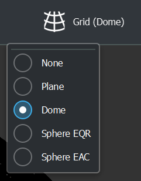
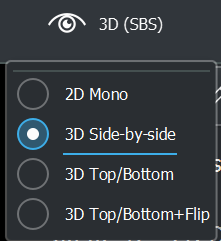

# How C-Play opens and interpret video and audio files

As soon as you load a video file from the master UI, the path to that video file is transferred to the nodes/clients, and they open the same file located at the same path on their system.

This might be the exact same file, which means all clients decode the complete video, but may show different parts, depending on the SGCT configuration files. This is referred to as "online splitting".

However, normally, for a high resolution movie, "pre-splittning" is applied, such that the clients only decode the necessary video content for that specific client.

In C-Play, this aspects is controlled by different "Grid modes", which can be paired with different "Stereo modes" for stereoscopic content.

### Grid mode

This is to indicate that you want to map your video on a physical object, or not.

A "pre-splitted" movie normally has the grid mode "None", as it is assumed to be already mapped correctly.

But "flat" movies are normally mapped onto a plane grid, fulldome/fisheye onto dome grid and 360 on a sphere.

In C-Play there are two different sphere grids, one for equirectangular video (EQR) and one for equi-angular cubemap video (EAC).

This option can be changed for the current video in the master header UI:

### Stereoscopic mode

There are various modes for C-Play to determine how you have mapped your 3D content of your video (or if it is not 3D).

The possible options for this mapping is:

     * 2D (mono)
     * 3D (side-by-side)
     * 3D (top-bottom)
     * 3D (top-bottom+flip)

This option can be changed for the current video in the master header UI:

### YouTube 360 3D videos

As an example, Google has a cubemap based format for 360 videos, called equi-angular cubemap, which is often used for 360 3D videos downloaded from YouTube. With such a video, you would need to specify user defined settings in C-Play as:

     * Sphere (EAC)
     * 3D (Top/Bottom+Flip)

## C-Play file structures

Read more how these and other settings can be save per video with a: 
 - [Video guide](guides/media/video)
  - [Audio guide](guides/media/audio)

And how to save your media bundle to make C-Play load everything correctly from one file:
 - [CPlayfile](guides/media/cplayfile)

 Also, multiple cplayfiles can be ordered in a:
 - [CPlaylist](guides/media/cplaylist)