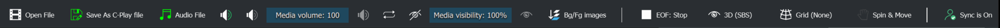

# Playback features

 

Most of the playback settings are conveniently available in the UI header (as seen above).

Here are further details on the available controls:

 - [Control/select media features](guides/playback/control_media)

 - [Control background & foreground images](guides/playback/images)

 - [Presentation (Slides & Layers)](guides/playback/presentation)

 - [Control 360 spin & move](guides/playback/spin)

 - [Enable/disable sync](guides/playback/sync)

